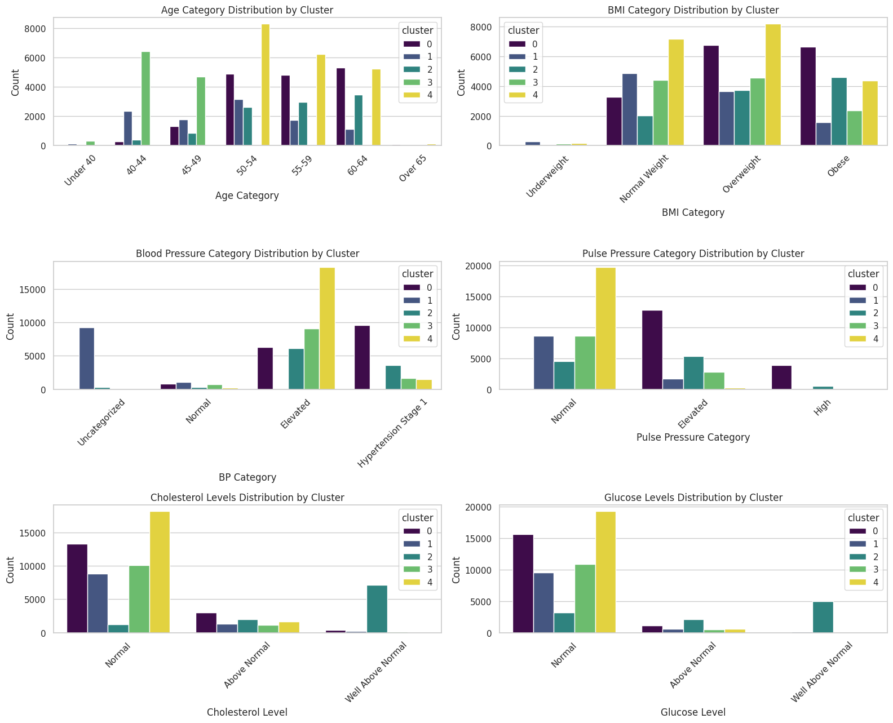

# **Comprehensive Cardiovascular Disease Data Analysis and Application**

## Team Composition
* Moses Kigo
* Josephine Wanjiru
* Eunita Nyengo
* Erick Lekishon
* Chepkemoi Chepkemoi

## Project Overview
This project aims to leverage machine learning techniques to predict cardiovascular disease based on clinical and demographic data. By analyzing historical patient data, we intend to uncover risk factors, develop predictive models, and implement these models in a real-world health application.


## Background
Cardiovascular diseases (CVDs) are a top cause of death globally, taking an estimated 17.9 million lives each year, according to the World Health Organization. Utilizing data science to predict cardiovascular disease can help in early diagnosis and potentially save lives through timely intervention.


## Data Description
The dataset for this project comes from a public health database. It includes records for 70,000 patients with features such as age, gender, blood pressure, cholesterol level, and other medical history indicators. This comprehensive dataset provides a basis for developing robust predictive models.


## Objectives
1. To identify the most significant risk factors for cardiovascular disease.
2. To develop and compare several machine learning models based on their accuracy and efficiency.
3. To implement a clustering model to segment the patient population by risk level.
4. To integrate these models into a user-friendly health application that can provide real-time assessments.


1. Key Risk Factors Identification: Use feature importance and exploratory data analysis to highlight significant predictors of CVD.
2. Predictive Model Development: Construct an accurate model to assess the risk of CVD among individuals.
3. Patient Segmentation: Efficiently segment patients based on risk factors to identify those at highest risk.


1. A concise report detailing exploratory data analysis findings and key insights.
2. An analysis of feature importance, emphasizing CVD risk factors.
3. A validated predictive model for assessing CVD risk, complete with documentation and user guidance.
4. A patient segmentation report, identifying and describing high-risk groups.
5. Targeted recommendations for interventions aimed at the identified high-risk groups.
6. A final presentation to stakeholders, summarizing findings, methodologies, and actionable recommendations.

## Methodology 
The project followed these steps:
1. **Data Cleaning and Preparation**: Filter out unrealistic entries and handle missing values.
2. **Feature Engineering**: Develop new features that may help improve model accuracy.
3. **Exploratory Data Analysis**: Visualize the data to understand patterns and relationships.
4. **Model Development**: Train and evaluate models like Logistic Regression, Random Forest, and Gradient Boosting.
5. **Clustering Analysis**: Use K-means to segment patients based on their risk profiles.
6. **Deployment**: Outline the process for integrating models into a web application.

**Data Acquisition Cleaning & Preparation**

```python
# Loading Dataset
path = 'cardio_train.csv'
df = pd.read_csv(path,delimiter=';')
#Display the first few rows
df.head()
```


  <div id="df-ee276431-f7a8-4231-8d60-4e483537725f" class="colab-df-container">
    <div>
<style scoped>
    .dataframe tbody tr th:only-of-type {
        vertical-align: middle;
    }

    .dataframe tbody tr th {
        vertical-align: top;
    }

    .dataframe thead th {
        text-align: right;
    }
</style>
<table border="1" class="dataframe">
  <thead>
    <tr style="text-align: right;">
      <th></th>
      <th>id</th>
      <th>age</th>
      <th>gender</th>
      <th>height</th>
      <th>weight</th>
      <th>ap_hi</th>
      <th>ap_lo</th>
      <th>cholesterol</th>
      <th>gluc</th>
      <th>smoke</th>
      <th>alco</th>
      <th>active</th>
      <th>cardio</th>
    </tr>
  </thead>
  <tbody>
    <tr>
      <th>0</th>
      <td>0</td>
      <td>18393</td>
      <td>2</td>
      <td>168</td>
      <td>62.0</td>
      <td>110</td>
      <td>80</td>
      <td>1</td>
      <td>1</td>
      <td>0</td>
      <td>0</td>
      <td>1</td>
      <td>0</td>
    </tr>
    <tr>
      <th>1</th>
      <td>1</td>
      <td>20228</td>
      <td>1</td>
      <td>156</td>
      <td>85.0</td>
      <td>140</td>
      <td>90</td>
      <td>3</td>
      <td>1</td>
      <td>0</td>
      <td>0</td>
      <td>1</td>
      <td>1</td>
    </tr>
    <tr>
      <th>2</th>
      <td>2</td>
      <td>18857</td>
      <td>1</td>
      <td>165</td>
      <td>64.0</td>
      <td>130</td>
      <td>70</td>
      <td>3</td>
      <td>1</td>
      <td>0</td>
      <td>0</td>
      <td>0</td>
      <td>1</td>
    </tr>
    <tr>
      <th>3</th>
      <td>3</td>
      <td>17623</td>
      <td>2</td>
      <td>169</td>
      <td>82.0</td>
      <td>150</td>
      <td>100</td>
      <td>1</td>
      <td>1</td>
      <td>0</td>
      <td>0</td>
      <td>1</td>
      <td>1</td>
    </tr>
    <tr>
      <th>4</th>
      <td>4</td>
      <td>17474</td>
      <td>1</td>
      <td>156</td>
      <td>56.0</td>
      <td>100</td>
      <td>60</td>
      <td>1</td>
      <td>1</td>
      <td>0</td>
      <td>0</td>
      <td>0</td>
      <td>0</td>
    </tr>
  </tbody>
</table>
</div>
    <div class="colab-df-buttons">

  <div class="colab-df-container">
    <button class="colab-df-convert" onclick="convertToInteractive('df-ee276431-f7a8-4231-8d60-4e483537725f')"
            title="Convert this dataframe to an interactive table."
            style="display:none;">

  <svg xmlns="http://www.w3.org/2000/svg" height="24px" viewBox="0 -960 960 960">
    <path d="M120-120v-720h720v720H120Zm60-500h600v-160H180v160Zm220 220h160v-160H400v160Zm0 220h160v-160H400v160ZM180-400h160v-160H180v160Zm440 0h160v-160H620v160ZM180-180h160v-160H180v160Zm440 0h160v-160H620v160Z"/>
  </svg>
    </button>


# **Data description**

There are 3 types of input features:

1. **Objective** : factual information;
2. **Examination** : results of medical examination;
3. **Subjective** : information given by the patient.

Features:

| Number | Column Name | Description | Feature Type | Data Type |
|--------|-------------|-------------|--------------|-----------|
| 1 | age | Age | Objective Feature | int (days) |
| 2 | height | Height | Objective Feature | int (cm) |
| 3 | weight | Weight | Objective Feature | float (kg) |
| 4 | gender | Gender | Objective Feature | categorical code; 1:Female, 2:Male |
| 5 | ap_hi | Systolic blood pressure | Examination Feature | int |
| 6 | ap_lo | Diastolic blood pressure | Examination Feature | int |
| 7 | cholesterol | Cholesterol | Examination Feature | 1: normal, 2: above normal, 3: well above normal |
| 8 | gluc | Glucose | Examination Feature | 1: normal, 2: above normal, 3: well above normal |
| 9 | smoke | Smoking | Subjective Feature | binary |
| 10 | alco | Alcohol intake | Subjective Feature | binary |
| 11 | active | Physical activity | Subjective Feature | binary |
| 12 | cardio | Presence or absence of cardiovascular disease | Target Variable | binary |

**Data cleaning**

There are no missing values or duplicates in this dataset

**Summary Statistics**

```python
#concise summary of the dataset
df.info()
```

    <class 'pandas.core.frame.DataFrame'>
    RangeIndex: 70000 entries, 0 to 69999
    Data columns (total 13 columns):
     #   Column       Non-Null Count  Dtype  
    ---  ------       --------------  -----  
     0   id           70000 non-null  int64  
     1   age          70000 non-null  int64  
     2   gender       70000 non-null  int64  
     3   height       70000 non-null  int64  
     4   weight       70000 non-null  float64
     5   ap_hi        70000 non-null  int64  
     6   ap_lo        70000 non-null  int64  
     7   cholesterol  70000 non-null  int64  
     8   gluc         70000 non-null  int64  
     9   smoke        70000 non-null  int64  
     10  alco         70000 non-null  int64  
     11  active       70000 non-null  int64  
     12  cardio       70000 non-null  int64  
    dtypes: float64(1), int64(12)
    memory usage: 6.9 MB

    
    Number of unique values for each categorical column:
    gender         2
    cholesterol    3
    gluc           3
    smoke          2
    alco           2
    active         2
    cardio         2
    dtype: int64
    

**Data Visualization**

# The distribution of numerical variables using histograms

    

    
# Box plot plotting to check on outliers
    


# Plotting scatter plots for each pair of numerical columns
    

    
# The distribution of categorical features
    

    
# The relationship between categorical and numerical variables using  violin plots.
    

    


**Correlation Analysis**

# Correlation Matrix Heatmap


    

**Exploring the Target Variable**

# The distribution of the target variable to understand class imbalance.
    

    

The target variable 'cardio' appears to be balanced, with approximately equal representation of both classes (0 and 1).

# Visualizing the relationship between the target variable and other features
    

    

# Feature Engineering

## **Summary of new feature categories**

- Age Categories
1. Under 40
2. Age 40-44
3. Age 45-49
4. Age 50-54
5. Age 55-59
6. Age 60-64
7. Over 65

- BMI Categories
1. Underweight
2. Normal Weight
3. Overweight
4. Obese

- Blood Pressure Categories
0. Uncategorized
1. Normal
2. Elevated
3. Hypertension Stage 1
4. Hypertension Stage 2
5. Hypertensive Crisis

- Pulse Pressure Categories
1. Normal
2. Elevated
3. High

</style>
<table border="1" class="dataframe">
  <thead>
    <tr style="text-align: right;">
      <th></th>
      <th>id</th>
      <th>age</th>
      <th>gender</th>
      <th>height</th>
      <th>weight</th>
      <th>ap_hi</th>
      <th>ap_lo</th>
      <th>cholesterol</th>
      <th>gluc</th>
      <th>smoke</th>
      <th>alco</th>
      <th>active</th>
      <th>cardio</th>
      <th>age_years</th>
      <th>age_category</th>
      <th>BMI</th>
      <th>BMI_Category</th>
      <th>BP_Category</th>
      <th>pulse_pressure</th>
      <th>pulse_pressure_category</th>
    </tr>
  </thead>
  <tbody>
    <tr>
      <th>0</th>
      <td>0</td>
      <td>18393</td>
      <td>2</td>
      <td>168</td>
      <td>62.0</td>
      <td>110</td>
      <td>80</td>
      <td>1</td>
      <td>1</td>
      <td>0</td>
      <td>0</td>
      <td>1</td>
      <td>0</td>
      <td>50</td>
      <td>4</td>
      <td>22.0</td>
      <td>2</td>
      <td>3</td>
      <td>30</td>
      <td>1</td>
    </tr>
    <tr>
      <th>1</th>
      <td>1</td>
      <td>20228</td>
      <td>1</td>
      <td>156</td>
      <td>85.0</td>
      <td>140</td>
      <td>90</td>
      <td>3</td>
      <td>1</td>
      <td>0</td>
      <td>0</td>
      <td>1</td>
      <td>1</td>
      <td>55</td>
      <td>5</td>
      <td>35.0</td>
      <td>4</td>
      <td>4</td>
      <td>50</td>
      <td>2</td>
    </tr>
    <tr>
      <th>2</th>
      <td>2</td>
      <td>18857</td>
      <td>1</td>
      <td>165</td>
      <td>64.0</td>
      <td>130</td>
      <td>70</td>
      <td>3</td>
      <td>1</td>
      <td>0</td>
      <td>0</td>
      <td>0</td>
      <td>1</td>
      <td>52</td>
      <td>4</td>
      <td>24.0</td>
      <td>2</td>
      <td>3</td>
      <td>60</td>
      <td>2</td>
    </tr>
    <tr>
      <th>3</th>
      <td>3</td>
      <td>17623</td>
      <td>2</td>
      <td>169</td>
      <td>82.0</td>
      <td>150</td>
      <td>100</td>
      <td>1</td>
      <td>1</td>
      <td>0</td>
      <td>0</td>
      <td>1</td>
      <td>1</td>
      <td>48</td>
      <td>3</td>
      <td>29.0</td>
      <td>3</td>
      <td>4</td>
      <td>50</td>
      <td>2</td>
    </tr>
    <tr>
      <th>4</th>
      <td>4</td>
      <td>17474</td>
      <td>1</td>
      <td>156</td>
      <td>56.0</td>
      <td>100</td>
      <td>60</td>
      <td>1</td>
      <td>1</td>
      <td>0</td>
      <td>0</td>
      <td>0</td>
      <td>0</td>
      <td>48</td>
      <td>3</td>
      <td>23.0</td>
      <td>2</td>
      <td>1</td>
      <td>40</td>
      <td>1</td>
    </tr>
  </tbody>
</table>
</div>
    <div class="colab-df-buttons">

  <div class="colab-df-container">
    <button class="colab-df-convert" onclick="convertToInteractive('df-8d9604a7-b463-4c5e-ac3f-200147ef3bfe')"
            title="Convert this dataframe to an interactive table."
            style="display:none;">

# checking correlation using a heatmap
    

    
#relationship between age and BMI
    

    
# Define age intervals of 5 years
  

    
This bar graph  may not be a true representation of the average BMI per age group due to non uniformity in the number of respondents in each age group.

  <div id="df-9b9d0b56-787e-4c78-a2cc-119bfec193ad" class="colab-df-container">
    <div>
<style scoped>
    .dataframe tbody tr th:only-of-type {
        vertical-align: middle;
    }

    .dataframe tbody tr th {
        vertical-align: top;
    }

    .dataframe thead th {
        text-align: right;
    }
</style>
<table border="1" class="dataframe">
  <thead>
    <tr style="text-align: right;">
      <th></th>
      <th>id</th>
      <th>age</th>
      <th>gender</th>
      <th>height</th>
      <th>weight</th>
      <th>ap_hi</th>
      <th>ap_lo</th>
      <th>cholesterol</th>
      <th>gluc</th>
      <th>smoke</th>
      <th>alco</th>
      <th>active</th>
      <th>cardio</th>
      <th>age_years</th>
      <th>age_category</th>
      <th>BMI</th>
      <th>BMI_Category</th>
      <th>BP_Category</th>
      <th>pulse_pressure</th>
      <th>pulse_pressure_category</th>
    </tr>
  </thead>
  <tbody>
    <tr>
      <th>0</th>
      <td>0</td>
      <td>18393</td>
      <td>2</td>
      <td>168</td>
      <td>62.0</td>
      <td>110</td>
      <td>80</td>
      <td>1</td>
      <td>1</td>
      <td>0</td>
      <td>0</td>
      <td>1</td>
      <td>0</td>
      <td>50</td>
      <td>4</td>
      <td>22.0</td>
      <td>2</td>
      <td>3</td>
      <td>30</td>
      <td>1</td>
    </tr>
    <tr>
      <th>1</th>
      <td>1</td>
      <td>20228</td>
      <td>1</td>
      <td>156</td>
      <td>85.0</td>
      <td>140</td>
      <td>90</td>
      <td>3</td>
      <td>1</td>
      <td>0</td>
      <td>0</td>
      <td>1</td>
      <td>1</td>
      <td>55</td>
      <td>5</td>
      <td>35.0</td>
      <td>4</td>
      <td>4</td>
      <td>50</td>
      <td>2</td>
    </tr>
    <tr>
      <th>2</th>
      <td>2</td>
      <td>18857</td>
      <td>1</td>
      <td>165</td>
      <td>64.0</td>
      <td>130</td>
      <td>70</td>
      <td>3</td>
      <td>1</td>
      <td>0</td>
      <td>0</td>
      <td>0</td>
      <td>1</td>
      <td>52</td>
      <td>4</td>
      <td>24.0</td>
      <td>2</td>
      <td>3</td>
      <td>60</td>
      <td>2</td>
    </tr>
    <tr>
      <th>3</th>
      <td>3</td>
      <td>17623</td>
      <td>2</td>
      <td>169</td>
      <td>82.0</td>
      <td>150</td>
      <td>100</td>
      <td>1</td>
      <td>1</td>
      <td>0</td>
      <td>0</td>
      <td>1</td>
      <td>1</td>
      <td>48</td>
      <td>3</td>
      <td>29.0</td>
      <td>3</td>
      <td>4</td>
      <td>50</td>
      <td>2</td>
    </tr>
    <tr>
      <th>4</th>
      <td>4</td>
      <td>17474</td>
      <td>1</td>
      <td>156</td>
      <td>56.0</td>
      <td>100</td>
      <td>60</td>
      <td>1</td>
      <td>1</td>
      <td>0</td>
      <td>0</td>
      <td>0</td>
      <td>0</td>
      <td>48</td>
      <td>3</td>
      <td>23.0</td>
      <td>2</td>
      <td>1</td>
      <td>40</td>
      <td>1</td>
    </tr>
  </tbody>
</table>
</div>
    <div class="colab-df-buttons">

# Add description
    

    

# **Removing outliers**

Blood Pressure: We chose to limit systolic (ap_hi) and diastolic (ap_lo) blood pressure to reasonable adult ranges, such as systolic from 90 to 250 mmHg, and diastolic from 60 to 150 mmHg.\
Height and Weight: Remove heights below 50 cm and above 250 cm.
In the same way, filter out weights below 30 kg or above 200 kg as they are less likely to be accurate.
  

    


## Clustering & Segmentation


```python
filtered_data.dtypes
```


    id                           int64
    age                          int64
    gender                       int64
    height                       int64
    weight                     float64
    ap_hi                        int64
    ap_lo                        int64
    cholesterol                  int64
    gluc                         int64
    smoke                        int64
    alco                         int64
    active                       int64
    cardio                       int64
    age_years                    int64
    age_category                 int64
    BMI                        float64
    BMI_Category                 int64
    BP_Category                  int64
    pulse_pressure               int64
    pulse_pressure_category      int64
    dtype: object


```python
filtered_data.head()
```


  <div id="df-b868b4a7-88cf-4c89-8e5c-e8ddf32b9c32" class="colab-df-container">
    <div>
<style scoped>
    .dataframe tbody tr th:only-of-type {
        vertical-align: middle;
    }

    .dataframe tbody tr th {
        vertical-align: top;
    }

    .dataframe thead th {
        text-align: right;
    }
</style>
<table border="1" class="dataframe">
  <thead>
    <tr style="text-align: right;">
      <th></th>
      <th>id</th>
      <th>age</th>
      <th>gender</th>
      <th>height</th>
      <th>weight</th>
      <th>ap_hi</th>
      <th>ap_lo</th>
      <th>cholesterol</th>
      <th>gluc</th>
      <th>smoke</th>
      <th>alco</th>
      <th>active</th>
      <th>cardio</th>
      <th>age_years</th>
      <th>age_category</th>
      <th>BMI</th>
      <th>BMI_Category</th>
      <th>BP_Category</th>
      <th>pulse_pressure</th>
      <th>pulse_pressure_category</th>
    </tr>
  </thead>
  <tbody>
    <tr>
      <th>0</th>
      <td>0</td>
      <td>18393</td>
      <td>2</td>
      <td>168</td>
      <td>62.0</td>
      <td>110</td>
      <td>80</td>
      <td>1</td>
      <td>1</td>
      <td>0</td>
      <td>0</td>
      <td>1</td>
      <td>0</td>
      <td>50</td>
      <td>4</td>
      <td>22.0</td>
      <td>2</td>
      <td>3</td>
      <td>30</td>
      <td>1</td>
    </tr>
    <tr>
      <th>1</th>
      <td>1</td>
      <td>20228</td>
      <td>1</td>
      <td>156</td>
      <td>85.0</td>
      <td>140</td>
      <td>90</td>
      <td>3</td>
      <td>1</td>
      <td>0</td>
      <td>0</td>
      <td>1</td>
      <td>1</td>
      <td>55</td>
      <td>5</td>
      <td>35.0</td>
      <td>4</td>
      <td>4</td>
      <td>50</td>
      <td>2</td>
    </tr>
    <tr>
      <th>2</th>
      <td>2</td>
      <td>18857</td>
      <td>1</td>
      <td>165</td>
      <td>64.0</td>
      <td>130</td>
      <td>70</td>
      <td>3</td>
      <td>1</td>
      <td>0</td>
      <td>0</td>
      <td>0</td>
      <td>1</td>
      <td>52</td>
      <td>4</td>
      <td>24.0</td>
      <td>2</td>
      <td>3</td>
      <td>60</td>
      <td>2</td>
    </tr>
    <tr>
      <th>3</th>
      <td>3</td>
      <td>17623</td>
      <td>2</td>
      <td>169</td>
      <td>82.0</td>
      <td>150</td>
      <td>100</td>
      <td>1</td>
      <td>1</td>
      <td>0</td>
      <td>0</td>
      <td>1</td>
      <td>1</td>
      <td>48</td>
      <td>3</td>
      <td>29.0</td>
      <td>3</td>
      <td>4</td>
      <td>50</td>
      <td>2</td>
    </tr>
    <tr>
      <th>4</th>
      <td>4</td>
      <td>17474</td>
      <td>1</td>
      <td>156</td>
      <td>56.0</td>
      <td>100</td>
      <td>60</td>
      <td>1</td>
      <td>1</td>
      <td>0</td>
      <td>0</td>
      <td>0</td>
      <td>0</td>
      <td>48</td>
      <td>3</td>
      <td>23.0</td>
      <td>2</td>
      <td>1</td>
      <td>40</td>
      <td>1</td>
    </tr>
  </tbody>
</table>
</div>
    <div class="colab-df-buttons">

  <div class="colab-df-container">
    <button class="colab-df-convert" onclick="convertToInteractive('df-b868b4a7-88cf-4c89-8e5c-e8ddf32b9c32')"
            title="Convert this dataframe to an interactive table."
            style="display:none;">

  <svg xmlns="http://www.w3.org/2000/svg" height="24px" viewBox="0 -960 960 960">
    <path d="M120-120v-720h720v720H120Zm60-500h600v-160H180v160Zm220 220h160v-160H400v160Zm0 220h160v-160H400v160ZM180-400h160v-160H180v160Zm440 0h160v-160H620v160ZM180-180h160v-160H180v160Zm440 0h160v-160H620v160Z"/>
  </svg>
    </button>

  <style>
    .colab-df-container {
      display:flex;
      gap: 12px;
    }

    .colab-df-convert {
      background-color: #E8F0FE;
      border: none;
      border-radius: 50%;
      cursor: pointer;
      display: none;
      fill: #1967D2;
      height: 32px;
      padding: 0 0 0 0;
      width: 32px;
    }

    .colab-df-convert:hover {
      background-color: #E2EBFA;
      box-shadow: 0px 1px 2px rgba(60, 64, 67, 0.3), 0px 1px 3px 1px rgba(60, 64, 67, 0.15);
      fill: #174EA6;
    }

    .colab-df-buttons div {
      margin-bottom: 4px;
    }

    [theme=dark] .colab-df-convert {
      background-color: #3B4455;
      fill: #D2E3FC;
    }

    [theme=dark] .colab-df-convert:hover {
      background-color: #434B5C;
      box-shadow: 0px 1px 3px 1px rgba(0, 0, 0, 0.15);
      filter: drop-shadow(0px 1px 2px rgba(0, 0, 0, 0.3));
      fill: #FFFFFF;
    }
  </style>

    <script>
      const buttonEl =
        document.querySelector('#df-b868b4a7-88cf-4c89-8e5c-e8ddf32b9c32 button.colab-df-convert');
      buttonEl.style.display =
        google.colab.kernel.accessAllowed ? 'block' : 'none';

      async function convertToInteractive(key) {
        const element = document.querySelector('#df-b868b4a7-88cf-4c89-8e5c-e8ddf32b9c32');
        const dataTable =
          await google.colab.kernel.invokeFunction('convertToInteractive',
                                                    [key], {});
        if (!dataTable) return;

        const docLinkHtml = 'Like what you see? Visit the ' +
          '<a target="_blank" href=https://colab.research.google.com/notebooks/data_table.ipynb>data table notebook</a>'
          + ' to learn more about interactive tables.';
        element.innerHTML = '';
        dataTable['output_type'] = 'display_data';
        await google.colab.output.renderOutput(dataTable, element);
        const docLink = document.createElement('div');
        docLink.innerHTML = docLinkHtml;
        element.appendChild(docLink);
      }
    </script>
  </div>


<div id="df-7284626e-6e4b-445d-9b9e-146dd3e7a5e0">
  <button class="colab-df-quickchart" onclick="quickchart('df-7284626e-6e4b-445d-9b9e-146dd3e7a5e0')"
            title="Suggest charts"
            style="display:none;">

<svg xmlns="http://www.w3.org/2000/svg" height="24px"viewBox="0 0 24 24"
     width="24px">
    <g>
        <path d="M19 3H5c-1.1 0-2 .9-2 2v14c0 1.1.9 2 2 2h14c1.1 0 2-.9 2-2V5c0-1.1-.9-2-2-2zM9 17H7v-7h2v7zm4 0h-2V7h2v10zm4 0h-2v-4h2v4z"/>
    </g>
</svg>
  </button>

<style>
  .colab-df-quickchart {
      --bg-color: #E8F0FE;
      --fill-color: #1967D2;
      --hover-bg-color: #E2EBFA;
      --hover-fill-color: #174EA6;
      --disabled-fill-color: #AAA;
      --disabled-bg-color: #DDD;
  }

  [theme=dark] .colab-df-quickchart {
      --bg-color: #3B4455;
      --fill-color: #D2E3FC;
      --hover-bg-color: #434B5C;
      --hover-fill-color: #FFFFFF;
      --disabled-bg-color: #3B4455;
      --disabled-fill-color: #666;
  }

  .colab-df-quickchart {
    background-color: var(--bg-color);
    border: none;
    border-radius: 50%;
    cursor: pointer;
    display: none;
    fill: var(--fill-color);
    height: 32px;
    padding: 0;
    width: 32px;
  }

  .colab-df-quickchart:hover {
    background-color: var(--hover-bg-color);
    box-shadow: 0 1px 2px rgba(60, 64, 67, 0.3), 0 1px 3px 1px rgba(60, 64, 67, 0.15);
    fill: var(--button-hover-fill-color);
  }

  .colab-df-quickchart-complete:disabled,
  .colab-df-quickchart-complete:disabled:hover {
    background-color: var(--disabled-bg-color);
    fill: var(--disabled-fill-color);
    box-shadow: none;
  }

  .colab-df-spinner {
    border: 2px solid var(--fill-color);
    border-color: transparent;
    border-bottom-color: var(--fill-color);
    animation:
      spin 1s steps(1) infinite;
  }

  @keyframes spin {
    0% {
      border-color: transparent;
      border-bottom-color: var(--fill-color);
      border-left-color: var(--fill-color);
    }
    20% {
      border-color: transparent;
      border-left-color: var(--fill-color);
      border-top-color: var(--fill-color);
    }
    30% {
      border-color: transparent;
      border-left-color: var(--fill-color);
      border-top-color: var(--fill-color);
      border-right-color: var(--fill-color);
    }
    40% {
      border-color: transparent;
      border-right-color: var(--fill-color);
      border-top-color: var(--fill-color);
    }
    60% {
      border-color: transparent;
      border-right-color: var(--fill-color);
    }
    80% {
      border-color: transparent;
      border-right-color: var(--fill-color);
      border-bottom-color: var(--fill-color);
    }
    90% {
      border-color: transparent;
      border-bottom-color: var(--fill-color);
    }
  }
</style>

  <script>
    async function quickchart(key) {
      const quickchartButtonEl =
        document.querySelector('#' + key + ' button');
      quickchartButtonEl.disabled = true;  // To prevent multiple clicks.
      quickchartButtonEl.classList.add('colab-df-spinner');
      try {
        const charts = await google.colab.kernel.invokeFunction(
            'suggestCharts', [key], {});
      } catch (error) {
        console.error('Error during call to suggestCharts:', error);
      }
      quickchartButtonEl.classList.remove('colab-df-spinner');
      quickchartButtonEl.classList.add('colab-df-quickchart-complete');
    }
    (() => {
      let quickchartButtonEl =
        document.querySelector('#df-7284626e-6e4b-445d-9b9e-146dd3e7a5e0 button');
      quickchartButtonEl.style.display =
        google.colab.kernel.accessAllowed ? 'block' : 'none';
    })();
  </script>
</div>
    </div>
  </div>


```python
# Compute the Pearson correlation matrix
correlation_matrix = filtered_data.corr()

# Extract correlation with the target variable
target_correlation = correlation_matrix['cardio'].drop('cardio', errors='ignore')  # Drop self-correlation to avoid irrelevant 100%

# Convert to percentage and round
target_correlation_percent = (target_correlation * 100).round(0)

# Sort the values in descending order
sorted_correlation = target_correlation_percent.sort_values(ascending=False)
print(sorted_correlation)
```

    ap_hi                      43.0
    pulse_pressure_category    34.0
    ap_lo                      34.0
    BP_Category                34.0
    pulse_pressure             32.0
    age                        24.0
    age_years                  24.0
    age_category               23.0
    cholesterol                22.0
    weight                     18.0
    BMI_Category               18.0
    BMI                        16.0
    gluc                        9.0
    gender                      1.0
    id                          0.0
    alco                       -1.0
    height                     -1.0
    smoke                      -2.0
    active                     -4.0
    Name: cardio, dtype: float64
    


```python
# Generate a mask for the lower triangle
mask = np.triu(np.ones_like(correlation_matrix, dtype=bool))

# Set up the matplotlib figure and draw the heatmap
plt.figure(figsize=(10, 8))
sns.heatmap(correlation_matrix, mask=mask, annot=True, fmt=".1f", cmap='coolwarm',
            square=True, linewidths=.5, cbar_kws={"shrink": .75})
plt.title('Correlation Heatmap')
plt.show()
```


    

    


```python
# Selecting features with the highest correlation with the target variable 'Cardio'
features = ['age_category', 'BMI_Category', 'BP_Category', 'pulse_pressure_category', 'cholesterol', 'gluc']

# Select features for clustering
X = filtered_data[features]

# Standardize the data
scaler = StandardScaler()
X_scaled = scaler.fit_transform(X)
```

```python
# Determine the optimal number of clusters using silhouette score
silhouette_scores = []
for n_clusters in range(2, 11):
    kmeans = KMeans(n_clusters=n_clusters, random_state=42)
    cluster_labels = kmeans.fit_predict(X_scaled)
    silhouette_avg = silhouette_score(X_scaled, cluster_labels)
    silhouette_scores.append(silhouette_avg)

# Plot silhouette scores to find the optimal number of clusters
plt.plot(range(2, 11), silhouette_scores, marker='o')
plt.xlabel('Number of Clusters')
plt.ylabel('Silhouette Score')
plt.title('Silhouette Score for Optimal Number of Clusters')
plt.show()
```
![image.png](data:image/png;base64,iVBORw0KGgoAAAANSUhEUgAAAkgAAAHHCAIAAADLcjBoAAAgAElEQVR4AexdB1wUx/dfQAEVBf2FmL8mWewlRo1G7MFoYkksMaZposQklmiaRrNYETFYUGzYS6xRYyWuNEGwIVZABFRAFJQiIL0cV/bP3pDN5u6Y27vbu9u9m/34SeZmZ968951h3s7Mm/cwCj0IAYQAQgAhgBCwIAQwC5IFiYIQQAggBBACCAEKKTY0CBACCAGEAELAohBAis2iuhMJgxBACCAEEAJIsaExgBBACCAEEAIWhQBSbBbVnUgYhABCACGAEECKDY0BhABCACGAELAoBJBis6juRMIgBBACCAGEAFJsaAwgBBACCAGEgEUhgBSbRXUnEgYhgBBACCAEkGIT9BjAcdzT0xOwGBUVhWFYVFQU+Onh4fHGG28ImnsLYq6srOzbb79t2bIlhmE///yzwCVjDxveWTUqcf24xXH8ww8/1K8uX7XWrFnTpk0bW1vbHj166EEzIyMDw7A//vhDj7qoijoCSLGpY2LSnLt3706YMOH11193cHBo1arVe++9t2nTJoYD9iQiHMWWlJTk7e2dkZHB8ElR1JYtWwz8s5TL5fv373d3d2/evLmTk1OHDh0mT5587do1divmSi9YsMDOzm7ZsmUHDx68desWX2zU1NRs3Ljx7bffdnJyatKkydtvv71x48aamhru9K9evert7V1UVMSuwh427Hxe0nDimPJZu3Ytu60//vgDw7CbN2+yM3lMm12xhYWFYRj21Vdf7d+//9y5c/WJFhUVNX78+JYtWzZs2NDV1XX06NEnT54EhflSbBr/Nuvjx4LzkWIzZ+devXrV3t6+ffv2vr6+u3btWrp06fDhw9u1a8fwVF1dzUxzwlFsx48fZ68dAbdvvPGGh4cHw7keidmzZ2MYNm7cuI0bN27ZsuWnn37q0KGDt7e3HqR4r9K3b9+BAwfyS7a8vNzDwwPDsNGjRwcGBm7dunXs2LG1wHp4eJSXl3Nsy9/fH8MwlY8M9rDhSId7MS6KrWXLlhUVFQxNi1dsBEHY2tpKJBJGZPXE0qVLMQzr0KHD0qVL9+zZs2bNmiFDhtTmHD58mKIovhSbxr9NdWYsPgcpNnN28QcffODq6qryuZ2Xl6eRJ8tWbLm5uTY2NtOmTWPLrlAo6kODXUyntFQqhU9AGqm1adNG782u+lqcPn06hmGbN29mtxgYGIhh2MyZM9mZkLRGxQYpb/grrYqtZ8+eGIatW7eOaUtEiq2+zmJk0ZiYOnVqkyZNNL4CmUDffPLJJ8x3KsgPDQ09e/asoBQb948qiLxmf4UUmzm7oFOnTkOGDIFwwJ5ENCq2pKSkIUOGNGrUqFWrVqtXr2aTysvL++abb15++WUHB4fu3bvv27ePeatCSuPfVUpKyoQJE5o3b+7g4NC7d++goCBQHUxSYMcJ/DcqKgrHcXYOs3QrKir6+eefX331VXt7+3bt2q1atUoulzNssBPXrl3DMIzNJPstSBcVFf3yyy84jtvb27du3Xry5Mn5+fngFURY8C3s7++/fv36tm3b2traxsXFURRVn4Aq7QKs2NKB5ZEeLbIpZ2Vl2dnZDR06lJ0J0u+++26DBg2ysrLATwzDZs+efejQoY4dOzo4OPTq1evixYvglbe3N5sxZunGHjagvy5fvvzjjz++9NJLzs7O06dPl0gkRUVFkydPdlE+8+fPVygUDCf+/v79+/dv0aKFo6Njr169jh8/zryiKIpNnJ0P0oDboUOHtmzZsrKyEmSqKDYP5cOu6+npieM4yGH6KzAwsE2bNo0aNXr//fczMzMVCsXy5ctbt27t6Og4duzYwsJChgLYigwLC+vRo4eDg0OXLl2YLT5QBjIOmeZUhgdDHCSkUuny5cvbtm1rb2+P4/iCBQuqq6vBK5Uu0Lgh37lz5xYtWpSWlqqQZX6qrNjgEFEUdeTIkV69ejk5OTVt2rRbt24bNmyo7RqNf5ugieDg4EGDBjVu3NjJyemDDz64d+8e07Snp2eTJk3S0tJGjRrl5OQ0btw4iqIePnz48ccft2zZ0sHBoXXr1p9//nlxcTFTRfgJpNjM2UfDhw9v2rRpYmJifUywJxEVbeTh4dGqVavXXnvt559/3rp169ChQzEMCw4OBqQqKyu7dOnSsGHDOXPmbNq0afDgwRiGgdFPUZQKKXXFdu/ePWdn565du65evTowMPCdd96xsbE5deoURVHp6ek//fQThmELFy48qHxyc3NPnz796quvdu7cGeSEh4dTFFVRUdG9e/f//e9/Cxcu3L59+5QpU2xsbOqzvMjOzq49hvnwww/ZW1hsWMrKyrp162ZnZzdt2rRt27b5+vr26dMHqCi4sGDK6Nq1a9u2bVetWrV+/fonT55ABGQ3SlFUbm7uwYMHX3rppZ49ewLpysvL9WhRhezOnTvrU+Rgetq1axeogmFYt27dXnrppeXLl69evRrH8UaNGoExk5CQMHHiRAzD1q9fz/CmonsAtZ49e44cOXLLli2TJ0/GMOy3334bNGjQpEmTtm7dOnr0aAzD9u/fz3D46quvzpo1KzAwMCAgwN3dHcMwkiSZt+wxyWQyCaDYLl26xF606aHYevbs2bVr14CAgMWLF9vb2/fr12/hwoUDBgzYtGnTTz/9ZGNjM3XqVKZRHMc7duzo4uLi5eUVEBDw5ptv2tragkGodRxqHB4MZSbh6emJYdgnn3yyZcuWKVOmYBj20UcfgbcHDx4cPHiwg4MD6IL09HSmFkg8fPgQw7BvvvlGJZ/9UyfFFh4ejmHYsGHDtiifH3744dNPP63vb5OiqAMHDtjY2IwcOXLz5s2rV692c3NzcXFhtq89PT1rmW/Xrp2np+f27dsPHDggkUjatGnTqlWrFStW7N6928fHp0+fPo8fP2YzLPA0Umzm7KDw8HA75dO/f//ffvstLCxMZaeCPYmoaCNwPHPgwAEggEQieeWVVyZMmAB+btiwAcOwQ4cOgZ81NTX9+/d3cnIC34wqpNQV27Bhw958803mm1ShUAwYMKD2xAtQ07iPr37G5uvr26RJk4cPH4JaFEV5eXnZ2dllZmYyOewEmC+aN28+fvz4tWvXpqSksN+CIwqgXJl8sM6ACwumjGbNmj1//pypCBeQKcYkVMwT9GiRIQUSv/zyS+2BIlDMKq/u3LmDYdjcuXNBPlgQMBYrT548cXR0HD9+PHircSuSPWyAUhkxYgSzJuvfv7+NjQ2z2ymTyV599VVmkU1RFLPSoiiqpqamW7du7JUlm7gK5xRFAcVGUdS77777yiuvAFJ6KDZXV1dmibBgwQIMw3r06CGVSkGLEydOtLe3Z8Yn2DBgVmklJSX/93//99Zbb4HC8HGocXioyBUfH49h2Hfffcfkz5s3D8OwCxcugByw6GHeqiSCgoLAx4dKPvunTort559/btasmUwmY1MAafW/zbKyMhcXF/Ymf25urrOzM5MDdLaXlxdDLS4uDsMwlZU681YUCaTYzNxNN27cGD9+fOPGjcH85erqymz6qXx6q2gjDw8PJycnZraiKGrs2LHMH/Pw4cNfeeUV9r7fkSNHMAwDG/oqpFQUW2FhoY2Nja+vbz7r8fHxqf3bfvr0KUVR6n88tZnqiq179+4jR45k0ciPiIhgq1sV6OVyeWBgYK9evZi9naFDh4IWAf36DKnhwoIpg/2Br1VAFcZAR7DP2HRtUZ3gt99+W2tHl5aWpv4qNTWVPY1iGNa/f392sc8//7xx48ZgXuOo2P766y+GAtCpbBvFjz766LXXXmMKMIkXL17k5+d///33Li4uTCZHxXbx4kUMwwICApgtMqZF+D4b6K9Zs2YxLZ45cwbDMH9/fyYHfFgwayMcx1u1asX+WyAIAsOwnJwciqLg41B9eDCtMAk/Pz8Mw5KTk5mcnJwcDMN+/fVXkANXbAcPHsQwbPfu3Ux19YROis3b29vOzi4kJESdjvrf5qlTp4AOZv8lDh8+vH379gzzGIY9efKEofbo0SMwAuvbPmFKCjaBFJsgukYikdy4cWPBggWOjo4NGzastdkFbLEnERVt5OHh0blzZzb3np6ebm5uIKdTp06DBw9mvwVfnYGBgVq3Iq9fv86oFpXEnTt3uCu2Ro0aqVQHP8Fkx+ZNJV1QUBAUFDRq1CgMwwYNGgTeOjo6fvnllyolwU+4sGDKWL58OVNXq4BMSSahsmLTtUWGDpPQumKbM2cOKIxh2JQpU5iKFEUtWbKEmbU5KrbY2FiGAjiZy83NZXI8PT2dnJyYn2fPnu3bt6+DgwPTfTY2Nsxb9phkMpkEs2JjL9r0WLGtWrWKoQlG/tGjR5kcQJBZxeI4/s477zBvKYras2cPhmHgrgh8HKoPDzYdkJ4xY4atra3KboqLi8snn3wCCsAVG+8rtry8vC5dumAY1rp166lTp7I1nLpiW716NdOP7ESzZs0Y5hs0aMD+CKYoau7cuRiGNWrUaPjw4YGBgczqWR0cYeYgxSasfgF/scuWLQNssScRdcWmckGbfQIPn3mjo6NV7PXT0tKY+6HAjmPevHnn1R6wk6n+x6Nxxebg4PD++++r0TjP/jaEow+2W8HmvoGKjf29r1VAda70UGzsFtUJ7tixQ+Vkiymzb9++2jmLfcZmuGJjVku1rQDFxtjd1K7X2fPypUuXbGxsPDw89uzZExwcfP78+UmTJmHYvxMFe0wyPDMJtmIDw2z9+vUqim3IkCHsnU+Kor766it14xGGJhj57J0xFYJwxQYfh0CxwTsLKDZmIxQwxl2xPXjwQNczNjhEFEVJJJK///77+++/d3NzY3/6qP9trly5EsOwgwcPqvwlMq4e2L3PYE5R1N27d319fQcPHmxra9u6dWvGmoldRrDpf8erYFm0KsYSExNrP8ZnzJgBpGZPIjopNvW9sqNHjzJbkQkJCbWHFqdPn2awjYyMZBRbXl4ehmELFixg3qokTpw4oaIXKYrq1q2bymzVtWtXlT00FTpaf/7666/Md/cbb7zBfSuSLaz6zKVVQHXGVBQbHF71FtUJZmZm2tnZvffee+qvhg4dqmIVqQIjeyty7dq1jDEkQ4o9bFR0QG0ZuGL7+eefGzVqxBxf1RrI6a3YKIoaMmTIK6+8snXrVvYF7fHjx6t05eDBgw1UbJCtSPg45NJZ6luRubm53Lcia40YO3Xq9L///a+srIzpI5UEYIOxqIRDxK4rl8tnzJiBYVhqamrtn6H63+Zff/1Vu5sdFhbGrsVO16fYmDJXr17FMGzRokVMjvATSLGZs48uXLjAPhigKArsGzCbdewZSifFBg4h/vzzTyCeVCodOHAgYzxSXFxsZ2fHbHZRFDVhwgRGsYH5qEWLFtnZ2Wx0GOOLkJAQFb1IUVTfvn1VZqtly5ZhGBYaGsomUlRUpPLlC97m5OQwG7AgRyKR9OzZ09bWFqwttBqP1CesxplryJAhEAHZDIO0imKDw6uxRXWa3333HYZhW7duZb/atm0b+8sGmGNgGHb79m1QLDMz09HRkTHJA+VVjFDYw0ZXxTZ37tzGjRszhysZGRngAJhhkk2cyWQS7BVb7UACizZws41ZNc6bN8/BwYEZTvHx8ba2tgYqNgzDVIxHevbsCbiCj0MunQW28adPn86I+dtvv3E3HqEoCnxpff755yqDPywsTOM9NjhEBQUFDCfA6U+txSaw4Ff/2ywpKWnWrJmHh4fKViqDv7piKykpYfNZWlpqa2s7b948dqMCTyPFZs4OeuONN9q0aTN37tydO3cGBgZOmjTJzs7Ozc2NubLNnkR0UmzAHt3e3v7XX3/dvHkz2NNjzP0pivriiy8aNGgwd+7cLVu2jBo1qnfv3mzFlpSU1Lx58//9739eXl47d+709fX94IMPunfvDsDKycmxs7Pr16/fvn37jhw5Au5Qz5o1C5icHDlyJDIyEphZ9+rVq0GDBt999922bdvWrl0L/oTYm2AM+jdv3rSxsRk2bJifn9/evXtXrVrVo0cPDMN++eUXUKasrKxr167A3H/79u1+fn79+vWLj48HVnxdunSpT1iNMxdcQIYrJqGi2ODwamyRIcUkysrKBg0ahGHY2LFjtyqfcePGqXseUTf3r7WKTEhIAHRu3LiBYdgHH3xw4MCBI0eOgNu17GGjq2IDa/fBgwdv27bNx8fn5Zdf7t69u35bkYBDMPbYK7bk5GRbW9u33norMDBw6dKlL7/88ptvvmmgYmPM/devXw/M/ZkvqoqKCsg45NhZwHTws88+27JlC0gz3xYqe7lAavX/Llq0CMOwjh07ent7792719/ff9iwYbU54IMMsMGs2OAQffTRR++8886yZct27969ZMkSFxeXnj17gkMyjX+bhw8ftrW17dat24oVK3bs2LFo0aKePXvOnj0bMKmu2E6fPt26detffvll69atmzZt6tOnT8OGDQXi3E4dWI05SLFphMVEmSEhId98803nzp2dnJyAb60ff/yR7WuDPUPppNgoisrLy5s6depLL71kb29fO3EwfzNAtvz8/AkTJjRu3Lh58+YzZsy4d+8eW7GBOzFTpkx55ZVXGjZs2Lp169GjR584cYLBZdeuXW3btq11n8jsSebm5n744YdNmzYFUzMoWVZWtmDBgvbt29vb27/00ksDBgxYu3atypcjKFlaWrpx48YRI0a8+uqrDRs2bNq0af/+/WvdjLFXtIWFhT/88EPr1q3t7e1fffVVT09P5tMVImx9M1d6ejpEQEZSkFBRbHB462tRhSY4KVm/fn3v3r2bNGnSuHHjXr16bdiwQQUfsAY6dOhQhw4dHBwc3nrrLeZ0BBCs9cfWunVrW1tbZk+SPWx0VWzA8gK01blz59phA7YuGebZxJlMJqGyYmMsldiKjaKoQ4cOgcvOPXv2DAsLYx8Pq6MHRj78jO3DDz8MCwvr3r27g4ND586d2YUpioKMQ/XmGFnYCalU6uPj06ZNm4YNG7722mvsC9ocFRtFUZGRkePGjXv55ZcbNGjg6uo6ZswYxgQasMH+I4VAdOLEieHDh7/88sv29vavv/76jBkzgP0nYFj9bxP0wogRI5ydnR0dHdu1a/f1118zpjfqiu3Ro0fffPNNrUcFR0fHFi1avPvuuxEREWw0hJ9Gik34fYQ4tGoE1FWFVcOBhEcIcEAAKTYOIKEiCAHzIYAUm/mwRy2LFQGk2MTac4hvK0EAKTYr6WgkJo8IIMXGI5iIFEKAfwSQYuMfU0TR0hFAis3SexjJhxBACCAErAwBpNisrMORuAgBhABCwNIRQIrN0nsYyYcQQAggBKwMAStSbHK5PCsrq7i4uAQ9CAGEAEIAISBmBIqLi7OyslR8NzPq24oUW1ZWFtu5NUojBBACCAGEgKgRqM81sxUptuLiYgzDsrKyxPyZgnhHCCAEEAIIgRKwUKkvno4VKbaSkhIMw0pKSpjlKkogBBACCAGEgBgRgM/nSLGJsU8RzwgBhABCwKoRQIqtrvvhQFj1GEHCIwQQAggBUSEAn8/Rik1UnYmYRQggBBACCAGKQoqtbhTAgUBDBSGAEEAIIATEggB8PkcrNrH0I+ITIYAQQAggBOoQQIqNExBovCAEEAIIAYSAWBBAiq2up+BAiKU7EZ8IAYQAQgAhAJ/P0VYkGiEIAYQAQgAhIDIEkGKr6zA4ECLrVcQuQgAhgBCwYgTg8zlasVnx0ECic0NAJlfEpBWciXsak1Ygkyu4VUKlEAIIASMigBRbHbhwIIzYA4i0mBEISczu5xeBEyT4188vIiQxW8wCId4RApaAAHw+Rys2S+hjJIOREAhJzHb7R6UBxeZGkG4EiXSbkQBHZBECHBFAiq0OKDgQHNFExawHAZlcwV6rMYs2N4Ls5xeB9iStZyQgSQWIAHw+Rys2AXYZYkkQCMSkFTDKTD0Rk1YgCC4REwgBq0QAKba6bocDYZVjAwkNQ+BM3FN1fcbknIl7CquM3iEEEALGRAA+n6MVmzGxR7TFjABasYm59xDvFo4AUmx1HQwHwsJHARJPdwTAGZuK8QiuNB5BZ2y6w4lqIAT4RAA+n6MVG59YI1oWhkBIYjaz98gkkFWkhfUyEkeMCCDFVtdrcCDE2LWIZxMgMPvwbUal4QTZaXEwsvU3AeyoCYQAHAH4fI5WbHD00FurRkAmVwxYGYkTpH9oytqw+zhB9loerlAg5yNWPSqQ8EJAACm2ul6AAyGErkI8CA2B6AfPcYLsviysqkZWLZV1XBSME+TD3FKh8Yn4QQhYGwLw+Ryt2KxtPCB5dUDg+0O3cIL0DroH6kzadQ0nyP0xGTqQQEURAggBIyCAFFsdqHAgjIA8IiluBPLLqtsvPIcTZHJ2CZBkc+RDnCBnHrwlbsEQ9wgB8SMAn8/Rik38PYwkMA4COy+m4wQ5NvAKQ/7W40KcIHv4hMmRj38GFJRACJgDAaTY6lCHA2GOrkFtChcBhUIxdG0UTpB/Xn/CcFkjk3dZEoITZNKzujUc8wolEAIIAVMiAJ/P0YrNlH2B2hINAjcz6MVZlyUhZdVSNtNT9lzHCXL35UfsTJRGCCAETIwAUmx1gMOBMHGvoOYEjsCvf8XjBDn/eLwKn9ui03CC/HbfTZV89BMhgBAwJQLw+Ryt2EzZF6gtcSBQUlXTeTG95Xjr8QsVjuMzi3CC7OYdisLWqCCDfiIETIkAUmx1aMOBMGWXoLYEjsCh2Mc4Qb63Llr9LrZUJu/mHYoTZEJWkcClQOwhBCwYAfh8jlZsFtz1SDQ9ERiz+TJOkLsupWus/+2+GzhBbo9O0/gWZSIEEAImQAAptjqQ4UCYoCdQE6JA4N6zYpwg2y88V1gu0cjwrkv0NQDPvdc1vkWZCAGEgAkQgM/naMVmgi5ATYgJgaVnEnGCnHX4dn1MA83XZUlIjUxeXxmUjxBACBgVAaTY6uCFA2HUPkDExYJAVY3sTeUR2qWHz+vjWS5X9PAJ02haUl8VlI8QQAjwiwB8PkcrNn7RRtTEjcDpO09xghywMhLuW2TGAdqHZOCFVHFLi7hHCIgWAaTY6roODoRo+xcxzicCn++IwQlyY8RDONF9VzNwgvxyVyy8GHqLEEAIGAkB+HyOVmxGgh2RFR8Cj/LLa533t/EinxVVwrl/kFta622r46LgaqkMXhK9RQggBIyBAFJsdajCgTAG9IimuBBYGZyCE+TXHMwdFQpFb99wnCBj0wvEJSPiFiFgGQjA53O0YrOMXkZSGIpAjUze2/c8TpAhiTlcaM0+fBsnyPXnH3ApjMogBBAC/CKAFFsdnnAg+AUdURMdAqH3cnCC7O17nqMRP/BO8tn2GNFJihhGCFgAAvD5HK3YLKCLkQg8IDD1D9qfyMrgFI600p+X4QTZYWFwVQ06ZuOIGSqGEOANAaTY6qCEA8Eb3oiQCBHILq5s40XiBPkov5wj+wqFou/vEbUuJa+k5nOsgoohBBACfCEAn8/Rio0vnBEdESOwKeIhTpC67iv+cjQOJ0j/0PsilhyxjhAQJwJmVmyBgYE4jjs4OLi7u1+/rsG93s6dOwcNGuSifIYNG6ZSJjk5ecyYMc2aNWvcuPHbb7/95EldOOOqqqpZs2a1aNGiSZMmH3/8cW5urtbegQOhtToqYKkIyOWKgasicYI8dSdLJxmP3cjECfLjrVd1qoUKIwQQAoYjAJ/PjbtiO3r0qL29/d69e5OSkqZNm+bi4pKXl6ci0qRJk7Zs2RIXF5eSkvL11187Ozs/ffoUlElLS2vRosX8+fPv3LmTlpYWFBTEVJ85c+Zrr70WGRl569atfv36DRgwQIWs+k84EOrlUY6VIHD5YT4IsabraVlmYQVOkO0WnCv/b5RtK8ENiYkQMCMC8PncuIrN3d199uzZQHi5XN6qVauVK1dCsJDJZE2bNt2/fz8o8/nnn3/11Vfq5YuLixs2bHj8+HHwKiUlBcOwa9euqZdk58CBYJdEaatCABjuLzmTqIfUYKkXdV/1c00PUqgKQgAhwB0B+HxuRMUmkUjs7OxOnz7N8DplypSxY8cyP9UTpaWljo6OZ8+epShKLpc7OTktX758+PDhrq6u7u7uDKnIyEgMw4qK/o30+PrrrwcEBKgTrK6uLvnnycrKwjCspKREvRjKsVoECsslHRYG4wR571mxHiDM+yseJ0i/4GQ96qIqCAGEgN4ImE2xPXv2DMOwmJh/L/rMnz/f3d0dIsn333/ftm3bqqoqiqJycnIwDGvcuHFAQEBcXNzKlSttbGyio6Mpijp8+LC9vT2bTp8+fX777Td2Dkh7e3tj/32QYlNHyZpzdl9+VOunf/Smy/qBcPJ2Fk6QYzfrWV2/RlEthABCQDSKbeXKlc2bN09ISAB9BvTixIkTmS4cM2bMF198oZNiQys2Bj2UUEdAoVC8HxBde0528Npj9bdccrKLK4F7yZKqGi7lURmEAEKAFwTMpth02or09/d3dna+efMmI7NEImnQoIGvry+T89tvvwEjEe5bkUxdiqLgQLBLorSVIHD7yQucIDstDjZELQ3xj8IJ8nySdrtcK0EViYkQMAEC8PnciGdsFEW5u7v/8MMPQEi5XN66dWuNxiOrV69u1qyZuvVH//792cYjH330EVjAAeOREydOAMr3799HxiMmGEmW18RvxxNwgpx7LN4Q0bxO3sUJcvnZJEOIoLoIAYSATgiYU7EdPXrUwcFh3759ycnJ06dPd3FxARfOJk+e7OXlBcRYtWqVvb39iRMncv55ysrKwKtTp041bNhw586dqampmzdvtrOzu3y57jBj5syZr7/++oULF27dutVf+WgFBQ6E1uqogIUhUFYt7bIkBCfIGxmFhogWFP8MJ8hRGy4ZQgTVRQggBHRCAD6fG3fFRlHU5s2bX3/9dXt7e3d399jYusCMHh4enp6eQAwcx/9r3oF5e3szEu7Zs6d9+/aOjo49evQ4c9yX6T8AACAASURBVOYMkw8uaDdv3rxx48bjx4/PydHukR0OBEMZJawEgSPXn+AE+e7aKIVCYYjIeaVVOEG743pRLjGEDqqLEEAIcEcAPp8bXbFxZ9TYJeFAGLt1RF9oCIwLvIIT5I6LaYYz9t462gIlJDHbcFKIAkIAIcAFAfh8jhQbFwxRGUtDICWnBDgNyS+rNly2JWcScYJcqtcVb8NbRxQQAlaIAFJsdZ0OB8IKR4Y1i+wddA8nyJkHb/ECQvDdbJwg3w+gL1miByGAEDABAvD5HK3YTNAFqAlhIVBVI+u+LAwnSL5cYRWWS8Ax2/NSHtZ/wgILcYMQECQCSLHVdQscCEH2HWLKKAiciXuKE2R/vwiZ3CCzETZzIzdcwgny7/hn7EyURgggBIyEAHw+Rys2I8GOyAoXgYk7r+EEGRD+gEcWff5Owglywam7PNJEpBACCIH6EECKrQ4ZOBD1wYfyLQyBxwXlOEG6eZFPiyp5FC08KZe+POAfxSNNRAohgBCoDwH4fI5WbPXhhvItE4E1oSk4QU7ZoyHmrSECF1fWtPGib7PlFNMuvNGDEEAIGBUBpNjq4IUDYdQ+QMQFgoBUJu+z4jxOkMF3+b9zNmbzZT3CcAsEGcQGQkBcCMDnc7RiE1dvIm4NQuC8csOw1/JwiVRuECFNlf3OJeMEOf+4QZ4nNRFGeQgBhIAqAkix1SECB0IVNvTbEhH4dt9NnCB/P2eUuKAX7ufhBDlodaQlIodkQggICwH4fI5WbMLqLcSN8RDILalqu+AcTpCpeXVetvltq6xaCuhnFlbwSxlRQwggBFQQQIqtDhA4ECqooZ+Wh0DghVScID/ZdtV4oo3fQvufPHYz03hNIMoIAYSA1viaaMWGBolVICCXK95ZcwEnyOO3sownMDC5nHM0znhNIMoIAYQAUmz/jgG0YvsXC+tLXU3Lxwmy29LQConUeNJffki30s8vwsBQOMbjEFFGCFgGAvD5HK3YLKOXkRRaEPjpyB2cIBca2TNIpUTWfiF9jPcov1wLQ+g1QgAhYAACSLHVgQcHwgCEUVWhI1BUIemwKBgnyLtZxcbm9dPtMThBHo59YuyGEH2EgDUjAJ/P0YrNmseGtcj+x5VHOEGO2nDJBDuEAeEPcIL84c871gIukhMhYA4EkGKrQx0OhDm6BrVpCgQUCsWI9Rdxgtwfk2GC9q6lF+AE2dv3vAmUqAnEQU0gBISJAHw+Rys2YfYa4oo3BOIzi3CC7LgouLiihjei9ROqlso6Krc9H+aW1l8KvUEIIAQMQgAptjr44EAYhDGqLGAEvE4m4AT5iwlN8CftosPimGaBKGDgEWsIASMiAJ/P0YrNiNAj0mZHoLxa2nVJCE6Q19ILTMbM5siHOEHOPHjLZC2ihhAC1oYAUmx1PQ4HwtqGhZXIe+xGJk6QHmsumPLE69bjQpwge/qEyfmL0G0l/YXERAhwRAA+n6MVG0cYUTFRIgB8XG2NSjMl9zUyeRflMjHpWYkp20VtIQSsBwGk2Or6Gg6E9QwI65H0QW4pTpBtF5zLKzV18M8pe67jBLn78iPrQRtJihAwJQLw+Ryt2EzZF6gtkyKw/GwSTpDT9t80aavKxrZFp+EE+e0+MzRtemFRiwgB0yOAFFsd5nAgTN8xqEWjIlAtlfX0CcMJ8kJKnlEb0kgc3DHo5h0qQ8dsGgFCmXwjIJMrYtIKzsQ9jUkrsIZRB5/P0YqN7/GF6AkDgbMJz3CC7Pt7hFn+yKUyebeloThBJmQVCQMPxIUlIxCSmN3PLwInSPCvn19ESGK2JQtMUUix1fUvHAjLHgRWKN1Xu2NxglwXdt9csn+77wZOkNujTWq3Yi5hUbtmRCAkMdvtH5UGFJsbQboRpGXrNvh8jlZsZhyQqGljIZBZWIETpJsXacZg1rsupeME6bn3urGERHQRAhQlkyvYazVm0eamDJ9klu0K03QLUmx1OMOBME1noFZMg8C6sPs4QX61O9Y0zWls5d6zYpwguy4JqZHJNRZAmQgBwxGISaN9k9b3LybNdH4JDJdFJwrw+Ryt2HQCExUWAQIyuaLv7/R5w9mEZ2ZkVy5X9FBar9x6/MKMbKCmLRuBM3FP69NqtV4CzsQ9tVTxkWKr61k4EJba/VYo14WUPOD4o1oqM6/4Mw7cwgky8EKqedlArVswAmjFprFz0YpNIywoU8QITD9wEyfI5WeTzC7DvqsZOEF+ucucO6JmBwExYFQEwBmbivEIfcCMztiMirtwiKMVm3D6wnic5JVWtVtwDifIBwKIGgNcn3RaHGz2taPxAEeUzY4AsopU7wK0YlPHBOWIGAHg8mP8litCkEGhUPT2DccJMtaEsQWEIDjiwcQIgL0B5rCtp0+YZdv6U+geGzPC0IqNgcJSEwqFYoh/FE6Qx25kCkTG2Ydv4wS5/vwDgfCD2LBIBE7foU1Ihq2LAtc35x+Pt0gx2ULB53O0YmNjhdLiRiA2nTZ97rokpLxaKhBJDsU+xgnys+0xAuEHsWGRCHgH3cMJ0jvo3sUHz3GCfHvFeYsPmYQUW91IhgNhkcPd2oT65WgcTpBeJxOEI3j68zKcIDssDK6qMbOJpnAwQZzwjsBHW67gBHn6ztNqqQxE1o3LtHBfbvD5HK3YeB9jiKB5ECiuqOm4KBgnSEH9SSsUdZfqrqTmmwcX1KqlIyCRyjsoR35GfjlFUd8foi+ZrDWfMznT4I0UWx3OcCBM0xmoFeMhsD+Gtq0fsf6iKYNlcxEHrCP9Q83mtZILk6iMeBG4m0X7uOm+LAyM/BO3smrtlUZuuCReibhwDp/P0YqNC4aojNARUCgUIzdcwgly7xXBxfY8diMTJ8iPt14VOoiIP3EicED5STd5T51X0sJySRsv2snW06JKcQrEiWuk2OpgggPBCUtUSKgIgI/WDouCiyokQuMReGRut+CccExahAYR4scQBOYei1cJZDFh69Xa2PEHYjIMISvwuvD5HK3YBN59iD1OCCw8dRcnyB//vMOptMkLDVwViRNk9IPnJm8ZNWj5CAxbF40TZERyLiPq1ig6gPuUf9ZwTL4lJZBiq+tNOBCW1OXWJkuFRAqiel4VqoHGvL/ob2q/4GRr6xokr7ERKKmqcVNuPD4vrWbaephbCmxxLXiTAD6foxUbMxhQQqwIHFeelg9efUGwd3dO3qbP88duvixWiBHfQkXgamo+TpADVkayGVQoFINXX6iNIB+SmMPOt6Q0Umx1vQkHwpK63Npk+WQbfaIgZCf62cWVOEG28SJLqmqsrXeQvEZFYEtUKk6Qsw7dVmll2d/0le15f1msCxL4fI5WbCrjAf0UGQKpefQN6LYLzuWWVAmZdeDri30QImRuEW9iQQDEsthxMU2F4SvKlVyv5eGWGkQbKba6HocDoTIs0E+xIPD7uWScIL/dd1PgDHudpM1bhBBMR+BAIfZ0QgDE1FX3si2RysHBs6XGuYXP52jFptMoQoWFhYBEKu+1nHaffz7pX5MwYbH4DzdB8c9wghxl6ddm/xEX/d8UCOQUV4Etbo1GIsAB9+qQFFOwYvI2kGKrgxwOhMn7BTXIAwLBd7Nxguyz4rxUJueBnDFJ5JXSc5CbFynAm3bGlBvRNiICofdygLcdjW0Al//DAy5qfCv2TPh8jlZsYu9fq+Z/yp7rOEGuCRXHN+l7yvtGFmyoZtVj0RzCrw5JwQnyt+OavX4XVUjaKoPuZhZWmIM747aJFFsdvnAgjNsJiLoREHhaVAlu8DwuoH2/Cv9ZciYRJ8ilZxKFzyriUBQITNp1rfa+2uHYJ/Vx++n2mNroo38Iz89cfQxzz4fP52jFxh1JVFJYCKw//wAnyIk7rwmLrfq5ARun7wdE118EvUEIcEVALlcA85B7z4rrq7PjIu2C5KvdsfUVEG8+Umx1fQcHQrwdbJ2cy+SKAStpP1Vn4p6KBYHCcknt5zNOkPll/zqJEAvziE+hIQAuunRaHAw5YE5ThgNsv/BcqcVdoITP52jFJrThivjhhEC0MlJw92Vh4grgCUIQnE14xklIVAghUD8CIDzNJ9u0RI0AFyjP3c2un5Io3yDFVtdtcCBE2bdWzPTMg3Q0Re+ge+LCwOfvJJwgF5y6Ky62EbcCRAAc2fqeTYLz5nuWHnJzjsXBi4nuLXw+N8WKLTAwEMdxBwcHd3f369frggaxcdy5c+egQYNclM+wYcPYZTw9PTHWM2LECKYijuOsN9jKlSuZVxoTcCA0VkGZwkQgv6y6ndLcKzm7RJgc1sdVeFIuTpDv+kfVVwDlIwQ4IjB282WcIP+O17L6j0krqN2x7+kTZmEuSODzudEV29GjR+3t7ffu3ZuUlDRt2jQXF5e8vDyVnps0adKWLVvi4uJSUlK+/vprZ2fnp0/rDk48PT1HjhyZ88/z4sULpi6O48uXL//nTU55uRbTODgQDFmUED4C4Eh8bOAV4bOqwmFxZQ0IAilwB2AqbKOfQkOgqkbWfuE5nCC1mvLXyORveofiBHkjo1BoUhjCD3w+N7pic3d3nz17NhBALpe3atUKvrSSyWRNmzbdv38/qOLp6Tlu3DiN8uM4vn79eo2vNGbCgdBYBWUKEAGFQvHu2iicIP+8Xq+VswDZZlgao/zQPn1HNDYvDOcoIRwE7jx5gRPkW8vDFQqFVq5+OnLH8qImwedz4yo2iURiZ2d3+vRpBvopU6aMHTuW+ameKC0tdXR0PHv2LHjl6enp7Ozs6urasWPHmTNnFhQUMFVwHG/ZsmWLFi169uy5Zs0aqVTKvNKYgAOhsQrKFCACNzIKcYLssiSkrFpLjwuQeYqi/JTOLecft1i368KE3cK4+uPKI5wgv96r4WRHXVLgzm3YOou6ZwKfz42r2J49e4ZhWExMDIP1/Pnz3d3dmZ/qie+//75t27ZVVXWe2o8cORIUFHT37t3Tp0936dKlT58+MpkM1Fq3bl1UVFRCQsK2bdtcXFzmzJmjTq26urrknycrKwvDsJISkZ3KqAtl5Tlzj9FBO8WrGC7cz6uNdzxo9X8CaFl5nyLxdUXgl6NxOEGuP/+AS8XiyhpwJi0WVwZchBKTYlu5cmXz5s0TEjR7iElPT8cwLCIiQl3sPXv2NGjQoLpa9XqQt7c328AEKTZ16MSVU1JV02lxME6Q4vVZXlYtBY6Osl5YoKMjcQ0n8XL7rj+9G3/hvqq9Qn0SfbGD9lGy+/Kj+gqILt+cik2nrUh/f39nZ+ebN2HxR1566aXt27er98G9e/cwDLt//77KK7RiUwFE7D8PXnuME+R766K5HC0IVtjxW67gBPnXzUzBcogYEzICxRU14KZ/YbmEI5+7LqWLy02PVrnMqdgoinJ3d//hhx8Al3K5vHXr1hqNR1avXt2sWbNr12DukbKysmxsbIKCgtRlPnTokK2tLdtmUr0MHAj18ihHgAiM3kSbOO+6lC5A3riztCaU9l0756ilXS3ijgAqaQgClx4+xwly8OoL3Ilk5JfjBNluwTmLieEOn8+Ne8ZGUdTRo0cdHBz27duXnJw8ffp0FxeX3Fw6dNbkyZO9vLxAx6xatcre3v7EiROM7X5ZWRlFUWVlZfPmzbt27VpGRkZERESvXr06dOgA9htjYmLWr18fHx+fnp5+6NAhV1fXKVOmwLsZDgS8LnorBAQSnxbXunztsDCY+4eqENhW5+Hyw3ycIPv5RYh63akuF8oxDQKbIx/iBPnDn3d0am6o0pZY6703nWiasTB8Pje6YqMoavPmza+//rq9vb27u3tsbJ07Tg8PD09PT4CLylVrDMO8vb0piqqsrBw+fLirq2vDhg1xHJ82bRpQihRF3b59u2/fvs7Ozo6Ojl26dPHz81M/YFMBHQ6ESmH0U4AIAFcLsw/fFiBvOrFUKam7hJSRr+XypU5kUWErQeDbfTf12LcA5rg/H9FNHQoWUvh8bgrFJhBo4EAIhEnERn0IVNXIuinvmV5+mF9fGRHlg3giIr2KJyKcLY9VhULR2/c8TpA3dbxwff0RfU+m+7IwiNNkEcEFn8+RYhNRV1o1q6fuZOEEOXBVpFyu/Uaq8JEKCKdj7ui6myR8uRCHxkbgWVElTpBtF5yrlNRdfOLYolQm7+ETVhtx+1r6v7eBOdYVYDGk2Oo6BQ6EAHsOscRG4DNlyMRNEQ/ZmeJNX0unPfj19j2PjtnE24lm4RxE9Ru14ZIerc9R3n5bQWrxm6wHZdNXgc/naMVm+h5BLeqMQLoyrFQbLzK7uFLnyoKsUC2VdVxEX8hLzSsVJIOIKYEi4BecjBOk10l9AkSQCdkW44MbKba6AQoHQqCjGLGlRGBlMG0fP/WPG5aEx6Rd9J3ZAzEZliQUksXYCHy+I6bWpdyxG/pcgiytqgGuk9Of02bnon7g8zlasYm6c62C+RqZHJyWh97LsSSBgdH2zIO3LEkoJItREZDJFV2XhOAEeT9Hz4X+l7ticYLceVHcN0EpikKKrW6kwYEw6nBExA1BIPReDjiOqpHJDaEjtLq3HtNWaj19wizDHEZo8FokPw9yS4EHcL2Dq+1Vek/+bPu//ntFChR8Ptdtxcb4JhYjFnAgxCiRlfD89d7rOEGuDE6xMHlrZPIuyq9v0YVLtbCOEJE4x25k4gRpiFrKLKwARpXFFTUiElydVfh8zkmxyeXy5cuXt2rVys7OLj2dXsMuXrx49+7d6o0JOQcOhJA5t2benhVVgsicjyzxLvOUPbTO3mNBrmk5jlWZXBGTVnAm7mlMWoHeiw+ObVlSsQWn7tKR1c4lGyLU+wHRtVsFZ+LEHREQPp9zUmw+Pj5t27Y9dOhQo0aNgGI7evRov379DAHX9HXhQJieH9QiFwQ2RtDegwz5ROXSirnKbItOwwny230wx9/m4s147YYkZvfziwBufIFrsZDEbOM1Z0mUP9h4CSfIc3cNgmtVCG2KJfY7lPD5nJNia9euHQgW4+TkBBRbSkqKi4uLuEYMHAhxyWIl3MrligErI2vdJZy6k2WRIsdnFuEE2c071HpWLSGJ2W4EyWg1nCDdlP+QbtM6wqtqZCDg0dMigy69gMPdbt6hoj60hs/nnBSbo6Pj48ePKYpiFFtSUlKTJk209oSgCsCBEBSriBmAAPBi3s07tKpGNycLYgFQKpN3WxqKE+TdrGKx8GwInzK5gr1WY9Sbm9IltPVod/0wBArJ8Ev9MrnireXhOEFeTRWxdzr4fM5JsfXq1evgwYNsxebj4zNo0CD9usdcteBAmIsr1C4EgVmHb+MEueRMIqSM2F99u+8GTpA7LqaJXRAu/Mek0f5W6vsXk2YJrp644KBfmd2XHyk3rnm4zfnrX3QYep+/ReyCBD6fc1JsZ86cqfWjv2rVqsaNG/v7+3/33Xf29vbh4eH6dY+5asGBMBdXqN36ECgsl4DLpPeeWfJqBkSA9Nx7vT4cLCn/TNzT+rSaBZgzGLunfvzzDk6QvHiVC0mkXZC8s+aCeD26wedzToqNoqhLly699957rq6ujRo1GjhwYFhYmLF7kXf6cCB4bw4RNBABMOOP3nTZQDoCr37vGR1kruuSEFEfeHAEGa3YOAKlsdg7ay7UOsS6+OC5xrc6ZZZXSzssFLdHN/h8rl2xSaVSHx+frCzRn97DgdBpWKDCxkZAoVC8t442Sj54jT7cteBHLlcAn+u3n7ywYDGBaOiMTe8uflEuAYvdogqJ3kTYFScrr5psixbrHjh8Pteu2CiKatKkSUaG6D3awYFgdzlKmx2BW49f4ATZaXGwxUSyh0A648AtnCADL6RCyljMqyBNu5FuBImsIuFdHHU/DyfIIf5R8GLc3+6PycAJ8pNtV7lXEVRJ+HzOSbGNHTt23759gpJKD2bgQOhBEFUxHgLzj9OH23OPxRuvCeFQ3neVnmK+3FUXXF44jBmDk50X03GCBJfuwRKkh08Y0mpaod5wnr7QyWP866wXtAuSNl7ki3J+loBaReC3AHw+56TYtm3b9sorr/z6669//vlnEOvhl1FjU4MDYezWEX3uCJRW1XReTHt6vaFjjGDuTQiqJHAA2GlxcLXUMm81MGgXVUjeVIZBP3LjSUxawdQ/aIvQeX9ZxecLA4J+CYDV3iuP9KuusdaI9Rdxgjx5W5THTPD5nJNis9H02NraagRLsJlwIATLthUy9uf1JzhBDl0bJV6TLZ16TaFQ9Pal7xVdf1SoU0XRFV5BJuEEOTzgIriydkG5vTZodaToBDExwwqFopfy5tkdXg9i/UPv4wQ569BtE4vDS3Pw+ZyTYuOFD7MTgQNhdvYQAwwCYwOvWEZkDUYirYnZyht7G85bSHxwjfJmFlYAS7wL9/NAgfJqabsF53CCzCys0FgFZQIEgOfi9gvP8eup4M4T+iT7jaWhEqn44mbA53Ok2NDfjrAQSM4uwQmy/cJz+WXVwuLMmNwcin1swS4xAXI/H6GvYU3ceY29EJ+w9SpOkEdvPDEmuqKnfTbhGU6QYzbzfPVFLleASIeXHvJwhcDEKPOj2KKjo0ePHt1O+YwZM+bSpUsmFsPw5uBAGE4fUeAFAe+gezhBfn/IusJvpj8vwwmyw8Jgfj/JeekRXogkPqWv66k7D1sXRu+G/XTkDi+tWCoRsIW7+DT/Lnh+O56AE6R30D3RQQefzzmt2A4ePNigQYPPPvtso/L57LPPGjZsePjwYXFhAQdCXLJYKrdVNbLuy8JqzZqj+biFKiKUFAqF++/nxe6+rz7AFQrFxJ3XNBr1gSvbb684z17G1UfHavM/3RZTu2d4/Bb/Vh5hyii+A1dFig5/+HzOSbF17tw5ICCAParWrVvXuXNndo7w03AghM+/NXAIXC4NWBlphf5wfzkahxPk2rD7ltfRwEikw8Jg9bO0aqms4yJxu8Awdn9JZXJgJJyaV8p7WxUSaQcl/vdz+CfOO7dsgvD5nJNis7e3T039z+3R1NRUBwcHdjPCT8OBED7/1sDhFzvo7/r15x9Yg7AqMoLgyB9vFeuFWRVxmJ+1MUWHB9Bm5StIzS53v9wVWxu8Zt9V0buAYETmN5H0jD51fmNpqFyu4JcyoAYi1IvOPwB8Puek2Nq1a7d9+3Y2ptu2bWvfvj07R/hpOBDC59/iOczIL6ejc3mRBoabEilQwPKt3YJz5dVSkYqgke1jNzNrL0u96R1any+owAupOEFOP2Bd0VY1YqUxE9x+mbjzmsa3hmcevEYbLo3fcsVwUqakAJ/POSm2rVu32tvbz5w584DymTFjhoODg4qqM6VI+rUFB0I/mqgWjwisVgb2nbLHKvzca8QNRFW1pPPFSoms7+90sGxIXB5gdN59WZgV7j9rHAYqmcQJ2r5jVUiKSj5fP7OLK8EHpbjskOHzOSfFRlHUqVOnBg4c2EL5DBw48MyZM3zBajI6cCBMxgZqSCMCUpn87RW09USwYWHvNRIXS+Y8ZZSslcHGmsJMjwNYjQ1YGQmx9mSirSY+teT4RHqDD/yDhCTm6E1Ba8UPNl6qDTHx181MrSWFUwA+n3NVbMKRR29O4EDoTRZV5AWB8KRcnCB7LQ8X411RXhCgKOrk7SycIMfyfV2JL/Z0pVNQVv2GMj74qTtazPlAtNXtovU0rysy3MtXSKTAr2ZOcRX3WrqWXBf+QHS7wfD5nJNiu3HjRmzsfzy0xsbG3rwpsj1xOBC6DgVUnl8EwNT2+7lkfsmKixrYFGrjRVpGTANwJfGDjZe0Wj2A2NDWvAtd30C9/qiwdhvD/ffz9RXgJT8hqwgnyC5LQiALa14a4pEIfD7npNj69Olz/PhxNk8nT550d3dn5wg/DQdC+PxbMIc5xVXgszQ1r8yCxeQimocymGREci6XwkIuk5FfDtxlXUnN18oncDfTZUmINa/XNaIEgiFM22/cVYRcXneNMuofb2camRFUJnw+56TYmjRpkp6ezpbq0aNHTk5O7Bzhp+FACJ9/C+YQnMSINzQUj13jdfIuTpC+ZzVbxvPYkLFJzTp0GydIjoswubzOye9N64jnwB38WUonoiawxQcDzxjOTbgLq1NJ+HzOSbG1aNEiJiaG3erVq1ddXFzYOcJPw4EQPv+WyqFcrhi8mo55bwzHCqIDLSie9go4aoP4XNaxoQaGjm5eZHJ2CTsfkgYzuGW7gYaIX9+rgasicYLksuqtjwLH/Ihk+pC7v1+EWFyQwOdzTortiy++8PDwKC6us1kqKiry8PD49NNPOUImkGJwIATCpFWxUXt1NyatwD80hb5/uiSkQmJR97f068q80ipge13frS/9yJqylkKhAC6gftUl0Jo1uIHWtRfyy6rBYDDBmWtVjazTYtoFTNIzrt8iuorDb3n4fM5JsT19+rRt27bOzs5DlI+Li0unTp0yM8VkG0pRFBwIfkFH1LQiEJKY3c+PvuEE/nVZEoLCKAPQhq2LxgnSqObdWnvHkALAwLXjouDs4krudB4pr+d3WBhcKbHwaKvcMYlMoVdRw9ZFc69iSElgwLUpQhyxk+DzOSfFRlFUeXn5jh07Zs2a9euvv+7fv7+mpsYQBM1SFw6EWViy2kZDErPd/lFpjG5zo2fzbKvFhBF8yZlEkTpcpyhKKpMPXRuFE+RqHS8UKxSK/soPncsPtRubMFhZdgJY4c89ZqII48DFydhAcbgggc/nXBWbBQwgOBAWIKBYRJDJFey1Glux9fOLQO4ngu9m17r5fz/ARN/p/A4bsKPY0ydMj92zucfijepig19JTUBtyp7rOEEeiDGRF828EnobvDZoVF6pEe/M8YUbfD7XotgePHhw/fq/Lo4iIiKGDBnSp0+f33//nS/+TEYHDoTJ2EANgUgljD5TScSkFVg5RIXlEoCJuFwc0fs61VIQuHLvlUd6dOKJW8r76SJZMeghoE5VFApFDx86hFNCVpFOFQ0pPGbzZbHEfYXP51oU20cffbRkWuqe5gAAIABJREFUyRKA1KNHjxo1ajR8+PCffvrJyclp/fr1hiBo+rpwIEzPj9W2CGLTqOgz5ueZuKdWiwwjOPCidDbhGZMjisT687QDi8GrL+h3Hc3C7qcb2GWPC2if4B0WBusHpn6tbzj/ECfIb/cZ99qcfryp1ILP51oU26uvvsoY+vv6+vbo0QNQ3717N5NWaU+wP+FACJZty2MMrdi09qnP30k4QS48dVdrSeEUyCut6rIkBCdIQ/Txu/70+dz5JNHfTze8X8D33zjTrl9BoPNOi0UQyR0+n2tRbI6Ojoz149ChQxcvXgw6LC0tzdnZ2fDOMyUFOBCm5MTK23pSWNF2wTlmicYk3AgSnbGBsQEMC9/1jxLRUFl4ir5aPjbwiiEXoQCRZX/fE5HgRmJ12d/3TG9DpFDUnX9Hpgj92wI+n2tRbK1atQJnbHK5vFmzZiRJgl5MTk5u1qyZkXrUSGThQBipUURWBYGM/HIQnIXRZyDhRpDIKpLBqriyBvgYyy0RwTE+RVGpeWXgYyU23aAjUjKBNpwZsf4iA4XVJsZvuYITpFb/0bzjs+g0/YGyQPC7BfD5XItimzRp0ujRozMzM9etW+fk5FReXg5wPHHiRPfu3XnH1KgE4UAYtWlEHCBwP6cUxKZ51z/qcOxjtm1kP78IZOvPHiejN9HH+KfviOPEcdr+m7yczRQoryTjBCk6wxl23xmerpHJOyyir0unPze199QL9/Nqr1H2/V3oLkjg87kWxZaRkdG+fXsbG5sGDRps3bqV6bBx48b98ssvzE9RJOBAiEIEUTOZkFUErLxGrL/4vLSaoijgeeRM3NOYtAJk5a/SuX7nknGC/O14gkq+AH8CD/RtvMjUvFLD2Ru5gY4NZshBneE8mJ0COOt60ztUa2AE3lmtqpGBs1KBh8eDz+daFBt941IqjY+Pf/bsPwZa8fHxBQUG7Tnw3h9aCcKB0FodFTAEgeuPCkFornGBV8TrLMoQBHStCz6cB62O1LWiicsrFIpxgfSmmddJfkxdlp+lDWf4omZiNPhq7uC1xzhBfrX7P8HC+CKulQ5Yf68//0BrSTMWgM/n2hWbGVnnt2k4EPy2haixEYi6nwfc0H2+I6asGjmEZGNTb7qsWgpOrbJeVNRbSAAvzimvk3deHJLH03Eg8MbrseaCAIQzGwsglrp/6H2zcHDsRiZOkKM3XTZL6xwbhc/nSLFxhBEV0xOB4LvZ7RfSNpBT/7ghojCGekrLa7WPlOYDf90UrlNWiVQOAsitC+ft6760qgZo9KdFOria5BV48xN7P4D2FxpupmsPz0ur3bxoFyRCtl1Ciq1umMKBMP9YtkQOTtzKAtZ9sw7fNuU9U8vAco0y7sGcY3GCFWff1Yza87DevuH8LsSBRrfaMEZl1VKgV/haBOsxfsD28uHYJ3rUNU0V+HyOVmym6QVrbOVADD3r4QQ5/3g8sg3RYwRcfpiPK+/2GXIzTI92OVYprap5a3k4TpAHrz3mWIVjsTqNflS4Gp2jIPoVAx4M+vtF6Fedl1qbI2kXJFP/uMELNWMQQYqtDlU4EMaA3pppbotOA1rNO+ie6S27LAP5SokM7OJm5NddsxGUXED9vLs2qkYm55exK6m0Rhe+xTm/UjPUwN/O94duMTmmTyRnl+AE2XGRcKMIwedzriu2S5cuffnll/369Xv6lL5Yc+DAgcuXBX20qD4U4ECol0c5+iGgUCj8Q+8DreYfel+Yqw39RDN9LRCx88/rgtsRyi6u7Ki8aBV6L4d3WKpqZB0WmucWF++y6EFw5sFbOEFuj07Toy5fVRQKBXCkYK5zPq2CwOdzTortxIkTjRo1+u677xwcHNLT0ymK2rx586hRo7S2LagCcCAExap4maldnHkH0a6AcILcZta/TPFiyOY8IJx2K/zjn3fYmUJIzz9Oh5iZsPWqkT5cPt8RY4xNTiFAp5UHEJfummE+XLS2orXAUmVcQOKEQG9SwudzToqtZ8+e+/fvpyjKyckJKLY7d+60bNlSKzSCKgAHQlCsipQZmVwBzJTpIFJ8n7uIFBMD2b6WXqC0zjhvJP2hH3spOSXAJujW4xf6UdBaa1MEfcZj3u04rUwaowAIitbGiyw398WYiw+e4wT59orzwjxKgM/nnBRbo0aNMjLoYHeMYktPT3dwcDBGvxqPJhwI47VrJZQlUvmsQ7dxgmzjRZ68nWUlUhtbzGqpDOz48eLUgy9uv95LB8CcedCIh0C3HhfiBNnTJ0yYsypfSKrTAf6vhweY31tmtVTWVRmuIT7TdAHh1AGpLwc+n3NSbG3atDl//jxbse3fv79Lly71NSnMfDgQwuRZLFxV1cim/nEDJ8j2C88hl4/89trEnddMGUZZK/NXlZYd7Race2RMk5YamRw4dkp6VqKVJUsqAM6n5x+PF4JQ4LRvXZh57onDEYDP55wUm5+fX9euXWNjY5s2bXr58uVDhw65urpu2rQJ3rDQ3sKBEBq3IuKnrFr6xQ568u20ODj6wXMRcS4KVoHhtUA25eRyBfDOvPRMorHR81SuC3ddog/1ref5ands7QfioVieb1DoB+BxZUzzURsu6VfdqLXg8zknxaZQKFasWNGkSRMb5ePo6MgEZjMq6/wShwPBb1vWQ62oQgLucr6xNNTAkCXWA5pOkgpqUw5Ev3xjaagJvO/vvJiOE+Q3Ar5KpVM/cikslyu6eYfWWuUIxAFxQVmdC5JnwvMCA5/POSk20CUSiSQpKen69etlZbpFUggMDMRx3MHBwd3dHUR3U+njnTt3Dho0yEX5DBs2jF3G09MTYz0jRoxg6hYWFk6aNKlp06bOzs7ffPONVq7gQDBkUYI7As9Lq0esv1gbXaWHT1hClhA34rnLItiSzKZccraZN+WqpTJgAr458qEJ4AIe7t9YGirl+56cCZjXr4m052Xg9hjvVwP144eiqI+3XhWmLRh8Puek2KZOnVpa+p+AFOXl5VOnTuUC1tGjR+3t7ffu3ZuUlDRt2jQXF5e8vDyVipMmTdqyZUtcXFxKSsrXX3/t7OwMbstRFOXp6Tly5Micf54XL/61who5cmSPHj1iY2Nrd0fbt28/ceJEFbIqP+FAqBRGP7Ui8Kyo8l3/KGA3dT/nP8NDa11UQCcEJu+hjTX2XH6kUy3eC++6RC+h3H8/XymR8U5cnaBcrui+LAwnyNtP/v2rVy9mSTknb2fhBPnx1qvCEWpLVCpOkFP2XBcOS4AT+HzOSbHZ2tqqaKP8/Hw7Ozsuorq7u8+ePRuUlMvlrVq1WrlyJaSiTCZr2rQpuF0AFNu4cePUyycnJ2MYdvPmTfAqJCTExsZGJbaOSi04ECqF0U84Akwg7AErI4XpFwPOv7jeAlcU3+2vG+1mYb64ogaomaM3THdbfMYB+qpy4IVUs4hs+kbB1TGfv5NM33R9LT7ILcUJssPCYLNfP1DhED6fa1FsJSUlxcXFNjY2aWlpJf88L1682L9////93/+ptKT+UyKR2NnZnT59mnk1ZcqUsWPHMj/VE6WlpY6OjmfPngWvPD09nZ2dXV1dO3bsOHPmTCYI3J49e1xcXJjqUqnUzs7u1KlTTA5IVFdX/8N1SVZWFoZhJSVm3s9R4VCMP9mBsAW4+S5GSOE8x2cW4QTZzTvUjC43QeDT9wOiTckDcDc6adc1OD4W83asMrLdmTgBhU1XKBSDV1+o9XAWksi/ixlDOs4gxWZjY2Or6bGzs1uxYoVWtp49e4ZhWExMDFNy/vz57u7uzE/1xPfff9+2bduqqirw6siRI0FBQXfv3j19+nSXLl369Okjk9HbIL///nvHjh3Z1V1dXdkxvsErb29v1gkdnUSKjQ2aHmn1QNh6EEFVdEJAKpN3W0rbFNzNKtapIl+Fs15UdFA60LqQonqOwFcTGumk5tWdOVlDwKNqaZ0jsccFwnINuuxv2pfQvL8EcQOBGScGKbbo6OioqCgbG5tTp05F//PExMTAN/2YtnVVbCtXrmzevHlCgmYnLunp6RiGRUTQTq85Kja0YmP6gpcECoTNC4x6EPlGeU1wx0Xz+A/85WgcTpBf7LhmYgcoCoWiz4rzOEFeTcvXAzRxVQHr8h4+YSYGWStKwCd1b99wQV2WN0ixAZkfP36sjvWTJ9q32nXaivT393d2dmaOzTTC/dJLL23fvp2iKI5bkWwicCDYJVFaIwLRD56jQNgakTFBJjDc+HqvGc7wgXUiTpBmMXz9+cgdnCDXCvKOML/9vl8Z5kmAZhoSad2GgaCseODzuZYzNtBz6sYjBQUFtra2XPrV3d39hx9+ACXlcnnr1q01Go+sXr26WbNm167BNtOzsrJsbGyCgoIoigLGI7du1Tn1CQsLQ8YjXLpD7zIhiXWBsL/ee90a9oX0BspIFe89K8YJsuuSEBMbgisUikm76Nv35nLEfOxmptAMBY3UxXOO0ctiHmOR88jnrMO0t7w1oSk80jSQFA+KzcbGRsUq8vHjx40bN+bC2dGjRx0cHPbt25ecnDx9+nQXF5fc3FyKoiZPnuzl5QUorFq1yt7e/sSJE/9Y9eeAS2llZWXz5s27du1aRkZGREREr169OnToUF1dDWqNHDnyrbfeun79+pUrVzp06IDM/bl0h35lTt7OarvgHE6Qsw6hQNj6QWhoLblc0cPHDLbv0UpPuO0XnsssrDBUBr3qZ72oqHXz327BOX6DdOvFi3ErDV1LX54x8SkmR5FO3aHvIYxYb34PlgzDBim2OcrH1tZ2xowZID1nzpyffvqpb9++AwYMYNqAJzZv3vz666/b29u7u7vHxsaCwh4eHp6eniCN47iKiYe3tzdFUZWVlcOHD3d1dW3YsCGO49OmTQNKEdQqLCycOHGik5NTs2bNpk6dii5ow3tB77cHrj0GYWjm/YUCYeuNIg8Vpx+4aWLbd5lcAS7gLz9rTgN0YJUnzBmfh35VkiipqgF/ZQVldR/ufFHmhc6LcgmI55D1wjzfN+pSGKTYhigfGxubAQMGgPSQIUOGDx8+ffr0hw9N4X1AXR69c+BA6E3WsiuiQNjC6d99VzNwgvxqd92noQkYA64C3/QOLaqQmKC5+pogTiTgBLmCNKdyrY83vvKBgcag1ZF8EeSdDoh5u+8qHeZFCA98Pud0xvb1119bgJU8HAghdJWgeECBsAXVHRRFgauynRYHV0tN4fijqkbWzy/C7KGcKYoKin+GE+QHG4XoipevQRJ4gXbwMfvwbb4I8k5ne3Saib+r4CLA53NOig00kJqaGhoaWllZSVGUupEknAkhvIUDIQQOhcMDOxD21ijzmJgLBw2BcKJQKHr7huMEef1RoQlYAr6UBqyMNLut0PPSapwg3bzIF+XmXDgaFfNp++l9ZiGHMgB3CtsvPFdaVWNUKDgSh8/nnBRbYWHh0KFDwWVtEEG71nvk3LlzOXIgkGJwIATCpBDYkMkV84/Hgx3/AzFC2XkQAjJm5wEYp204b/RTgMJyCbgSLpCYse8HRNe6qQy+m232LjASA+6/09f1bmSY4pNFPxEUCsUQpW/Yc8LoBfh8zkmxTZ48ecSIEVlZWUwE7dDQ0K5du+oHkLlqwYEwF1dCa5cOhK007W3jRZ64hQJhC6t/DsXShjyf7/jXlY+R+APOJkZuuCSQO7neQbTzi8WnjR4Ezkh4wsnmFFfVetBvu+BchUQKL2net75nk3CCnHMszrxsgNbh8zknxdayZcv4eNqfCqPY0tPTmzRpIgTxuPMAB4I7HQsuyQ6EbcFfx+LtwXRlWJMOC4ONuj34uKC8/UL6dselh0IJGxt2L6eWn6Fro8TbdxDOQxJp6UYKMp4nm+2YtAKcIN9aHm5Kf6FsBthp+HzOSbE5OTkBG0hGsd28ebNFixbsZoSfhgMhfP6NzSEKhG1shA2nr1AowJ7V1VQjupiarVyyTxZSpJLiyhpgbp5TXOdF1nAwhUNhZXAKTpBeJzW7EhQOnzUy+ZvKOKg3BbBlCp/POSm2UaNGgZDZTk5Ojx49ksvln3766YQJE4SDOBdO4EBwoWDBZYoralAgbFH0L3DbaDwXU3HKSAJuXmTSM2HFwRiz+TJOkKfuWOD2+Bc7aN8uR65rd1Jo9iH645+0h7OVweZ3QQKfzzkptsTExJdffnnkyJH29vaffPJJly5dWrZsmZYmMmM5OBBmHzFmZIAdCDs+EwXCNmNXaG/62A3axdQE48SiVCgUn22PwQly7jFhuXKnKMovOFmAPua1d5i2EjK54g1l6AazR0jXxin9/kzcU5wg31sXzaWwUcvA53NOio2iqOLi4hUrVnz66aejRo1atGhRdrb4zJPgQBi1D4RMnAmE3dv3PAqELeSeArxlFta5mDJG4MfzSbl0VMlFwQIMs3dR6dxrwMpIMd41goyrh8pInp0Xh0hlckgxgbwqrqgB3vXMHlsHPp9zVWwCgdUQNuBAGEJZvHXZgbAf5QsrCpR4UTU25wNWRuIEGf2AZ8sOqUw+bB1tVS+EjSZ1DCskUmDSYvYpVZ03Q3L+Unp5/nSb0S1dDWGSXffzHfSafvflR+xM06fh8zknxXaxnsf0whjSIhwIQyiLtC4KhC3Sjpv3F33LkHf18+f1JzhB9vAJK64UxA1c9d4BXp3+FMNZlDrz9eUsOn1XXA7DQASliTthkVjqE5bHfPh8zkmx2fz3YUJq88ilCUjBgTABA4JqAgXCFlR36MTMydu0q/WxgVd0qgUvXCGRvq0M6Wn2L3EInwHhD3CC/OHPO5Ayons1ehNtFHM24ZlYOH+UXw7iLZSY1QUJfD7npNiKWU9+fn54eHjfvn1BJGuxdAZFUXAgRCSI4awygbDHBl4xr39bw2WxQgrZxZU4QbbxInmcWTZGPMQJcvDqCxKpcE96rj8qrNUBvX3DLeaYrapG1k4ZEMpcUYH0+/MBEXb+jjenMobP55wUm7rw0dHRvXr1Us8Xcg4cCCFzzi9vF1EgbH4BNQc1jzUXcIKMSKZDGxr+PC+t7rokBCdI805VWgWRSOUghrvFWDndfvJCjKra7xxtofrzEXMuneHzuZ6KLSUlBXke0fp3KMACIYk5HRYG4wSJAmELsHe4s+R1kj6Y8eUpTBo45hm7+bJAHGhBcPhqdyxOkHuvmNlyAcKhTq/2XnmEE+Q3f9zQqZbZC4Olc/dlYWa05ORBsSWwnvj4+JCQEA8Pj4EDB5odX50YgAOhEymRFkaBsEXaceps8xjJJe15GTDgjkkrUG9IaDlbo+jgKd/tvyk0xvTj5+cj9H3njRFG92qtH3v11ZLK5CCee2y62cYMfD7ntGIDfv3ZFiT9+/dPSTH/5fP6cNeYDwdCYxVLykSBsC2pN/NKabe5bl6k4UekIDC3WBYNCVlFOEF28w4VgrtCw0cU8JfP+80NwxnTSgF4wPn9XLLWkkYqAJ/POSm2x6wnMzOzqkqU7trgQBgJfYGQBUECcYL0Dron/O0mgYAmcDbAnbOQxBxD+LyZQZtjtPEiH+aWGkLHZHVlckU3pbtCC3CRU1QhAcGhDP86MRn+TENnE+jor++azy01fD7npNgYYUSdgAMhatEgzCsUirVh98Hfz5rQFIsxJ4OIbCWvlpxJBF8qesurUCjGb7kiCve7bBm/U8bktID4t8CXiseaC2zpxJIuqaoB9pzpz8vMwjN8Pueq2KKjo0ePHt1O+YwZM+bSJfGFaYcDYZa+MVKjMrkiJq3gTNzTq6n5S4Po6Q8nSAuYCIwEl0jJBt/NxglyeMBFvfkPSaQpdF4cklsipj0YYHDx1e5YvQUXSMVNyisWP5nVttAQKCbton0377yYbggRvevC53NOiu3gwYMNGjT47LPPNiqfzz77rGHDhocPH9abJ7NUhANhFpaM0WhIYnY/vwigzJj/okDYxoDavDQLy+s2svLLqvXgpEYmBwc868Lu61HdjFUeKJ0rdlocLOQrd1zw+XbfDZwg95jbNxUXVjWW2XOZNun8bLt5nIHB53NOiq1z584BAQFs2datW9e5c2d2jvDTcCCEzz8XDkMSs92U6zNGpYFESKL4nFZzkdfKy4xYf1FvpxX7YzJqL671Wh5eVi3oqM3qXaxQKHr7htdG5jSjSZ46V7rmMFLcevxC17oCKf+kgPbH3XbBueIKM/hgg8/nnBSbvb19amoqG83U1FQHBwd2jvDTcCCEz79WDmVyhfpajbadI8h+fhGWYUWmFQSrKuDzdxJOkAtP3dVV6tKqml7Lad0g0qX8D8qoYAHhD3QVXDjls17URWkwajB0Y8v7fgDtNftM3FNjN6ROHz6fc1Js7dq12759O5v0tm3b2rdvz84RfhoOhPD518ohCNyuslZjforilpJWGVEBNgLhyigzelimAXuid/2jasQQKoUtMkgDf80i8oivLgKZQB9wfrhJfMYKbFlWhdCxv83ivRM+n3NSbFu3brW3t585c+YB5TNjxgwHBwcVVceWVphpOBDC5FknrkAMQEaTqSTM8lWlE/+osK4IFFfWtPGiLYN0sv7ILakCjqkMvCqgK7c8lgebYO0XnquQiGwflQHhd6VXKj1W2wwFISRuPaavi3TzDjX9FxJ8Puek2CiKOnXq1MCBA1son4EDB545c0YIsOrEAxwInUgJsLBEKgc3bVX0GfMTrdgE2GuGswR8w5++o8NeEHEiASfIj7deFe/dD4VCYaSgdIb3CEcKnyojlR+7mcmxvDCLyeSKt5R72lfT8k3MIXw+56rYTMy0MZqDA2GMFk1G81lR5UfKC0mMGmMn0BmbyTrC9A0Bd7S/HU/g2PSD3FKwyLv1uJBjFWEWA0Hp/ILN5vnCEFikMnnnxbTX6QciuRcPEXbuMTo64HKe3JZCGlJ5BZ/PdVBsEokkKyvrCetRaUngP+FACJx5CHsXHzwHH01veoeuCk5xU1qLMIoN/ERWkRAARf3qwv08EG6GoxRT/6BNzGccuMWxvGCLnbpDB6Ubs/myYDmEMJaSU4ITZNclIRZg0gXuU3qsuWDiDQD4fM5JsT18+HDQoEFMfFFbW1vgPRLScwJ8BQdCgAxrZUkmV6w//8BNecry4aZLTwoqKIpSucfWzy8CaTWtSIq3QFm1FLgwznpB9z78uZqWD+yzzeUtAs6eTm9zS2hvmW28SLPYmuvEqnrhozfoYOVf7DBzEGp1xvTIKauWgoAhqXkmdUECn885KbYBAwa88847wcHBcXFx8axHDxTMWAUOhBkZ06/pwnIJCOGhdIl0l200zHgeiUkrsIBPQv3wsZ5aYBf6L22nNXK5YsxmOljz4tOJlgEOCHcZes8gb5lmgQJEHVoZLDI/8vVhBSaibdFp9RUwRj58Puek2Bo3biw6X/7qUMKBUC8v5JzbT16AK2udFgefuJUlZFYRb8ZGYE0obXI951gcvCEQ6abrkpDnpfp4KoETN8vbxacN9ZZpFrYpihq14RJOkBazlbLvKn3Z/5NtV02JJ3w+56TY3n777cuXRbmXzQYaDgS7pJDTCoXijyuP2i88R7vW9o9KySkRMreINxMgcPkhvcHY3y8CcshRLZUNWh2JE+QmsYX+ggAITnfeD4iGlBHgq0qJDOweZxdXCpA9PVgCl83beJEvyiV6VNevCnw+hym2kn+eyMjI/v37R0VFFRQU/JNH/18/hsxVCw6EubjSqd2yaumsw7eBYcisQ7dLq8zgyUYnhlFhEyBQKZGBD53HBeX1Nbdb6davz4rz4r34pS7ai3IJOGAW1xoUhArqs+I85ENEXViB5wDvbidvm273CD6fwxQbsBABNiPsNDIeMcsge5Bb+u7aKJwg2y04t/fKI0v6qzALnpbU6KfbYnCC/PP6E41CFVfWgHjHR+opoLGWKDI/2Ejv6YnL+cCuS+mWFAQcjBP/UDo21qxDt002bPRXbNHaHpPJwEtDcCB4acJ4RE7dyQIXX/r5RYjXa6rx8LFyygHhD3CC/PHPOxpx8AtOxgnyvXXRUnE60NIoFMhcQdLeMokTXK/xQUiZ7BVwdBl44T/ed03WupEauvPkBU6QbywNNVnIBfh8DluxGQkCc5GFA2EurrS2W1UjW3DqLth+/Gp3bIFeMUq0toIKiBqBa+kFOEG+rWl362lRZYdFwThBRiTnilpGjcxfSNHtGp9GIibOHLz6Ak6Qlx+a2lWHUcWUyxW9fc+bUi74fA5TbAnaHqMixTtxOBC8N8cLwczCCuAzyc2LDAh/gGz3eUHV8ohUS2UdldpL/S7RnGNxIGiWRe5dl1VLQRznzELt1/iE0O9MFL3iSks7IJ9/nHZB4h10zzQ4w+dzmGID52o29Ty2tramEYCvVuBA8NUKj3QiknPf9A6tPULo6RMW/eA5j5QRKctDYOJOOpyxShiae8+KgXlFfGaR5YkMJPp461WcII/dEIfTReApRo+ADMLvvtB7ObUbA4NWR5rmEwo+n8MU22Ntj/CxZnMIB4Jd0uxpqUy+WhkPAifIcYFXnhVZiFmw2YG1YAY2Rz7ECfL7Q//xlQVuzpolqojJoAYheH4+ovl80WRscGwInIbOOarl0iFHaoIqViGRgk1v0zjAhM/nMMUmKNQMZwYOhOH0+aKQV1r1+Q7ayA2s6012GMsX/4iOWRAAAUTeWh4ulysAAxcfPMcJsv3Cc8DXmlm4MkGjwE+YWKznPfder439u+9qhgmQMX0TQDrT2MXA53OYYgsKCqqpoTeCg+p5TA+cIS3CgTCEMo91Y9ML+qygz2C7Lgk5m/CMR8qIlGUjUCOTd1lCO4wHd/ZlcsVIpXsLn7+TLFvwqpp6zxeFJrhCoejpE1a7DRNnoTvDB649xgly/JYrJkAePp/DFJuNjU1eXh5FURpP2dAZG7+dp1AotkenAZcE7wdEq1sB8NscomZ5CEzeQ68G9lx+RFHUiVu08/tu3qGmdAZhLkgn7aLPF/fgyhP0AAAgAElEQVTHCH0ZxMRHrZbKzIWVUdvNLq6sXY+6eZH5xjfe1l+xGRUC0xOHA2F6ftgtFlfWTNt/E2w//nI0zpLcQ7DFRGmjIrAtOg1EED1+K7PXcnplsDXKpH5pjSodhHjghVRRxOIB7jrHijPUDgR/9itwZV6rS252Ff3S8PkctmLTrz3B1oIDYUa2E58Wg6stHRYGH4p9bBqbIjPKi5o2EgLbomjFxvxr40UGxekQWdtIXJmA7G3l7eDuy8KY80UTNKpHE8vP0tfJl5yxkOgKGhFYp/QVYIKAf/D5XItii4mJOXv2LCPA/v373dzcXF1dp02bVl0tMh/hcCAYGU2ZUCgUR288AaZEA1dF3s0qNmXrqC1LQiAkMduNpdWAenOzIBfykM6SyuRvLKUvxiQ+FfRf0ATlzQRTOlSEgGakVwlZRcBEwNjbrfD5XItiGzly5KpVqwAEd+/ebdCgwXfffbdu3bpXXnnF29vbSNAYiSwcCCM1CiFbKZH9+hd9pREnyG/+uPH/7Z0LWBRV/8cHkYVUBDXMQBkvmea1zFCzJDPLylffesrSVHyt7IK9+targ7dIDfCSYl5fLc3MwltoOQJeEknFu1wFBBQVEEVQBJTb7s7fZbb5bwscdpeZ2Vn2u4+Pz5mZc/mdz288X8+Zc7lzT76NsQlW4ZEtElBrtPwxRkJ3TRC2gcGH7GFd/+Tqk8HXxyh36LVSrek2V7cFTGa+rAdyyvw+azRafvqb1Etvye15PcLWrl27M2fO8Ghmz549ePBgPrxjx44nnnhCZmQNLI4MooGZm5v88q1Sfj/sTgHs6sMZCh9CMbd2iC8zgdhM3ZZadf2JzSyQ2R75i+N3FvbbdEr+ok0sMTm3iJ/O0+j/sQf8miDDiCu5Pa9H2Jydna9d0y/pHzx48Ndff817MSsrq0WLFiZ6VCHRyCDkNDIi8To/cvL0wgPHMxvVlnFyYkRZAoE9cTl1qZrNbX4vVMqswIXcuw/2H3liXmSlUjd6/vnkVZph3/vupFn1ssXIBy/coBn22RBptyAht+f1CJu3t3dMTAzHcRUVFQ899NChQ4d40ImJia1atbIt6GQQ8tSlUq3hPyDTDPv2utgbd8vkKRelNG4C6LFpNNqnFhygGfbslUJl+nrmTl0/ZklUqjLNE9Gq+xX6lYUp1yU8s5PcntcjbB9//PGgQYP+/PPPzz//vE2bNhUV+u9AW7du7d+/v4gsZMiKDEIGA/KKyvh97WiGDd6X0vjOEJGBIYqolQD/ja3WySN28o2N47hPt+rO4P1WqUeE858e9ifn1erBRnaT/+Qp6XHt5Pa8HmG7devW888/7+Dg4OrqGh4eLtB/8cUXZ8+eLVzaRIAMQuoqHMu41a/6f5S9AqOi7OPllhop8jckwM+KNNS2jgxrJ7MieQ4/VW978c76WEMsCgmXlld1CtB9BL1pH4M0/LjrqNUSbkFCbs/rETb+tSgqKlKr/7ZUvrCwUOi9KeTVqdcMMoh6k1scQaPRrjyUzm+y/uqKP68UlFqcFRKCAIFAZNJ1w7mRA4MPRSZdJ8RvZI8u5ZfQDNt1dkRZ5d8aKyVU82T1gXkDg/WfcpRgkqQ23Lhbxn/0vVks1dcWcntukrBJikC2zMkgJDLjdmkFvzEof86vAv/JSVRxZGsVAmqNNjazYE9cTmxmgT3M8jeErNVqBwQdenBW+LEMxU3IWh+jWzsvw7JlQyDWDf9j1VGaYbedviqRGeT2HMImEXZdtnHX7jwb8gfNsI/PiZBhjxkJa4KsQcAWCPCnqi6OVNwEDf77n53scMa/KSsO6s5R+uBH/Wox0V8fCJseKRmEuNy1Wu2W2KzHZu+jGdZ3yWFJZweJazlyAwHbJbCzeuvn0VJ+2rEMDv8fXLta25OUo1u3131upETDVOT2HD02y15UUqrS8qrPfjnPDzF/tOXs3bLGdgY8qfJ4BgLWI5BzR7e7fKcAVlH/6PKLy/k974vtqSnQavW74RxO1R0RI/rP+sK2evVqmqadnZ19fHxOnapla4ANGzY899xz7tW/YcOG1Rrno48+oigqNDRUAETTNGXwCwkJER7VGiCDqDWJBTfTbxQPW3aEZtgus/Z99+cl7GhsAUMkAQGLCfguOUwz7KGUGxbnIHpCfsHyS8uOiJ6zwjOcHZ5IM+zs8EQp7CS355L32LZt26ZSqTZt2nThwoUPP/zQ3d2dP+PNsKrjxo1bs2ZNXFxcamrqpEmT3NzccnL+tit5eHh43759PT09jYRtwYIFeX/9SkvrmW1IBmFoj8XhPXE5/GGPPkEHz2QpdKGoxbVDQhBQPoFZ1Y2poo5X/WZ/Gs2wX+yIVz49cS08nHqTZtiBwYek+P89uT2XXNh8fHz8/f15XhqNxtPTk9y1UqvVrq6uP/74o4A4JyfHy8srOTmZpmkjYTO8FOLXFSCDqCuViffLq9Rzdyfxw4/jvjshwzl7JhqGaCBgVwT2JuTSDPtKqG6/JIX8xn9/kmbYLSeuKMQe2cwoq1R3n6s71V2KUxfI7bm0wlZRUeHo6Lh7924B5cSJE0eNGiVc1gwUFxe7uLgIZ+VoNJqhQ4euWLGC47iawvbII4+0bt36ySefXLJkSVVVVc3cDO+QQRjGNDecffveqOq5rTTDfrM/zd6mWZuLC/FBQDoCt0p0H7Rohi2Q/hBnU2qh1Wp7B9rAkTqm1MWCOB9Un58cevCiBWnJScjtubTClpubS1FUbOz/7wUwY8YMHx8fgsWffPJJ586dy8r0y/qCg4OHDx/O92SNhG3ZsmXR0dEJCQnr1q1zd3f/z3/+UzPb8vLyu3/9srOzKYq6e1fk7csOp97s85XutOK+8/cfTpPkM2nNeuEOCIBAXQT4zavYBEUsTr98q1S3bHxOhGJ3Z64Loyj3t53Wbf08cuVRUXIzzMSWhC0kJKRVq1YJCQl8Bc6ePfvII4/k5ubyl0bCZljJjRs3Nm3atObZp4GBgQbzS3RBEYVNrdEujdKNntMMO2rV0ezb9wxNQhgEQMAqBOb/rjuoepY0cxbMrdHu87qDF95YI+HmUuaaJGf8/OJyftMl0Td8t6awmTUUuXTpUjc3N+H4N47jQkNDHRwcHP/6URTVpEkTmqZrOiY5OZmiqLS0NKNHIvbYjPZ0uFVSPu67E7yqzduTJPVxsUb1wiUIgEBdBPhZiC8sja4rgpz3A39Lphn2q9+T5SxUUWWNXn3sQZ/155Mib0FiTWHjOM7Hx2fq1Kk8aI1G4+XlVevkkcWLF7ds2fLEiROGLikoKEgy+Hl6ejIMU1O9OI7bunVrkyZNbt++bZjcKEwGYRTZ6NJoF75+Cw70+Uo3bv7EvMg9cX+bwGmUEJcgAAIyE7hbVsnvOJx7577MRdcs7p9rdM26PbcSq/7QbUEy+YfTNeE05A65PZf2GxvHcdu2bXN2dt68eXNKSsqUKVPc3d1v3NAtMZkwYUJAQABfsUWLFqlUql27dv01dT+vpKSW09MNhyJjY2NDQ0Pj4+MvXbq0detWDw+PiRMnkjGRQRDS8vum850zw78HBB1Kv1FMSIhHIAACViEwqrqXsOtstlVKFwqtqNJ0nRNBM2zWrXoWIwlJGl8g5bruDNjH50TcrxBzc2pyey65sHEct2rVKm9vb5VK5ePjc/Kk/gBZX19fPz8/3otGS60pigoMDKzpYENhO3fu3IABA9zc3FxcXJ544ong4OCaH9iMciCDMIosXPInXRnqmRAeEHQIEyAFUAiAgHIILI5MpRn2P9vjrGtSYrZuW6k+X+2XYiGXdatmeularZbfUezgBTFXzZPbczmEzXQEksYkg6iraJxNXBcZ3AcBxRI4mn5LuqXBptd6S/URcRM21rLdkumZNIKY8/bo1vgG/KqfFShKjcjtOYStHsh74nSTmur6Y89D5/WAw2MQsB6B+xXqrrN1Y4CXrToG+MWOeJphl+03ntRmPTDWKfnIxXyaYZ/5+qBGoxXLAgibniQZRF240WOriwzug4CSCYz5XyzNsFtPWnO/j5eqt41V1MaVVnFZeZW6xzzdFiTx1+6IZQC5PUePrR7O/De2jjU6bR2r90DDN7Z68OExCFiJwLeHdJPxPt16zkrlc8VllfwSrvzicmvZoJxyP9pyVtzOK4RN71wyCMIbwM+KNNS2jgzbkWEjkxSxtQHBcjwCAbslcCarkGbYpxYcEHH4yyyYxzN13/meDfnDrFSNNfKOM9dohn11xZ9iVZDcnqPHZhJno3VsA4MPQdVMAodIIGAlAhVVGv6oDWsd87smOsO6XUYrga+92IIS/RYkYi0uhLDpQZNB1O4Ng7tGO48YPEEQBEBAiQQmbjxFM+z3Ry9bxbgpW87QDLs+JtMqpSuw0DfXHhfxlANye44emwJfAJgEAiAgAoH1MZlS7HlhomUDgg7RDHvyUoGJ8Rt9NL4L67dJnMUPEDb9C0MG0ejfKlQQBOyNQFKObn10zy+jqtQameueV1RGM2ynALa0vJ7jtGQ2zIrFXbxRzB90cK9CBCbk9hw9Nis6GkWDAAhISECt0fJHSp2/StpFVgoLopLzlHbeqRTVNCtPrVb73OI/Hiycj0rOMythrZEhbHosZBC1ssNNEAABmybAf+hafThD5lrwe3oxu8Tca0PmKkhRHH/WwYyd8Q3PnNyeo8fWcMLIAQRAQKEEfozNohl23Hd/OzZEBlv5M61+OSXyWS0yWC5pEfxWZ70Do3afz4nNLGjIOmAIm95TZBCSuhOZgwAIWIVAxk3dd53H50SUVYq5tTy5LhqNtteXumOtLuTeJce0t6e/x+caLghuyLopcnuOHpu9vVqoLwjYEQGtVtv/64M0w8Zmyjc7MeNmCc2w3eZGyD9pRcmurXn+V0N2uoCw6X1NBqHkFwK2gQAIWEzg32Hnxd3MqV5Ldp3Nphn2rXXH641pPxHqOv/L4r0Jye05emz282qhpiBgjwS2nb5KM+yba+WTGf6UloV7L9gj7jrqLPpu8hA2PWkyiDrcgdsgAAK2TeBa4T2aYbvM2lci15KyUauO0gz7e3yubYMT1XrRz/8it+fosYnqPWQGAiCgPAL88qnDaTdlMK28Sv3Y7H0Pdjy5VnhPhuJspQj02KTyFFnhpSoV+YIACFibwMydCTTDBu1LkcGQuGt3+FMFtFrRDtWUwWypixD9/C9ye44em9QORf4gAAJWJsCPg732rWhnphDqs/m4buXcJJF2RCQUZHOPxD3/C8KmfwHIIGzuLYHBIAACJhK4WazbubFjAHu7tMLEJBZH+8+2OJphQw9etDiHRpxQxPO/yO05emyN+C1C1UAABPQEXlp2hJblcOCh30TTDCvP9zxb9K5Y539B2PTeJ4OwxVcENoMACJhI4Ms9STTDztuTZGJ8y6IV3aukGZZm2ELpu4aWWdhoUpHbc/TYGo2jUREQAIE6CUQm6bbbf/Gb6DpjiPHgz/R8mmGfX3xYjMyQB4kAhE1PhwyChBDPQAAEbJxA0b3KjgG6vtSNu2XSVWXVH+k0w0795bx0RSBnngC5PUePDe8JCICAXRAYuVK3bnr3+Rzpavv+5jM0w35/9LJ0RSBnngCETf8mkEHgdQEBEGjcBIL3pdAMK8phYLWC0mq1Ty/Ubbh89kphrRFwU0QC5PYcPTYRUSMrEAAB5RKITrtJM+yzIX9ItHQ69859mmE7z9on5xE5ysUtsWUQNj1gMgiJvYDsQQAErEzgXkVVl1m6za6uFkiy2VVE4nWaYeVZBm5llAoontyeo8emABfBBBAAAVkIvLXu+IOT0sKkOdg6OEI31DkrPFGWqth7IRA2/RtABmHvrwnqDwJ2QGDZgYsPFpl9Js2sxXfWx9IMu/30NTsAaf0qkttz9Nis7yFYAAIgIA+BE5cKaIZ9euFB0T+zqTXaHvMiaYZNyyuWpy52XgqETf8CkEHY+VuC6oOAPRAor1J3mxtBM+zFGyLLz8UbxQ+6a0/Mi1RrsKm/HK8SuT1Hj00OH6AMEAABhRAY//3JB7te/XBM5KVm289coxl2zP9iFVLNRm8GhE3vYjKIRv8eoIIgAAIcx62JzqAZ9sMfz4hLY3Z4Is2wwbIc+Sau5TaaG7k9R4/NRt0Ks0EABCwhwB8E2jswStwxw9dX/kkz7L7E65bYhDTmE4Cw6ZmRQZgPFilAAARsj0CVWtMrMIpm2ITsO2JZX1ap5lfI5dy5L1aeyIdMgNyeo8dGpoenIAACjY0Av6PjuiOZYlXs7JXbEk22FMvCxpcPhE3vUzKIxud41AgEQKBWAhuPXqYZdsLGU7U+teDm99UZvr/5tAVpkcQyAuT2HD02y6giFQiAgK0SSM27SzNs97mRFVUaUerw2S/naYZdeShdlNyQiSkEIGx6SmQQpqBEHBAAgUZAQKvV9ltwgGbYU5fF2YZ/yJLDD04x/TM9vxHAsZUqkNtz9NhsxY+wEwRAQDQC/j+foxk29ODFhud4u7TiwcI4mmGL7lU2PDfkYCIBCJseFBmEiTQRDQRAoBEQ+PnkVZph3xZjPTV/Gs7QpdGNAIsNVYHcnqPHZkOuhKkgAALiEMi6VUoz7GOz992rqGpgjisOpj/ork3fFtfAfJDcLAIQNj0uMgizmCIyCICATRPQarXPhvxBM2zMxYZ+GPvXD6el2KPLpvHKYDy5PUePTQYXoAgQAAHFEfhiRzzNsCERqQ2xTJiHcv7q7Ybkg7TmEoCw6YmRQZiLFfFBAARsmsCv57Jphh216mhDanGt8B4/pFlWqW5IPkhrLgFye44em7k8ER8EQKAxEMgrKqMZtlMAW3Tf8tmMexNyaYb9R8PUsTHQlL0OEDY9cjII2f2CAkEABKxMYOg30TTD7k/Os9iOr9kLNMPO3Z1kcQ5IaBkBcnuOHptlVJEKBEDA5gnM2a07aybwt2SLa/L2uliaYXeezbY4ByS0jACETc+NDMIyuEgFAiBguwT2JV6nGfbl5TGWVaFKrek+N5Jm2IybIp/HbZk9dpWK3J6jx2ZXLwMqCwIg8P8ECv/aNCS/uPz/75ocSrmu23Oy55dRGo3W5ESIKA4BCJueIxmEOLCRCwiAgE0ReHWF7oDQ3+JzLbA67JRu+5KxG05YkBZJGkiA3J6jx9ZAvEgOAiBgwwQW7tXN/gj4NcGCOgT8mkAz7KLIBq2Es6BcJOE4DsKmfw3IIPCugAAI2CGBP1Jv0Aw7ZMlhC+o+orq3F5lk+aRKCwpFEp4AuT1Hjw3vCQiAgP0SKC6r7DxrH82w2bfvmUXhXkVVpwDdpv55RWVmJURkUQhA2PQYySBEYY1MQAAEbI7AG2uO0Qy7/cw1syw/dbmQZtgBQYfMSoXIYhEgt+fosYnFGfmAAAjYJIGlUWkWbM+/IeYSzbBTtpyxyTrbvtHWF7bVq1fTNO3s7Ozj43Pq1KmaSDds2PDcc8+5V/+GDRtWa5yPPvqIoqjQ0FAheWFh4bhx41xdXd3c3CZPnlxSUiI8qjVABlFrEtwEARBo9ASOZ9yiGdYn6KBWa8as/U+rjypdE53R6Pkos4Lk9lzyHtu2bdtUKtWmTZsuXLjw4Ycfuru737x504jUuHHj1qxZExcXl5qaOmnSJDc3t5ycHMM44eHhffv29fT0NBS2ESNG9O3b9+TJk0ePHn3sscfGjh1rmKRmmAyiZnzcAQEQsAcCZZXqrnMiaIbNzK/nP8eGNAYv0p16czzjluFNhGUjQG7PJRc2Hx8ff39/vrYajcbT0zMkJIRQebVa7erq+uOPPwpxcnJyvLy8kpOTaZoWhC0lJYWiqDNn9OMAkZGRDg4OubmkxShkEEJxCIAACNgbgbEbTtAMuyU2y8SK3yoppxm2YwB7t8zyDZRNLAvRaiVAbs+lFbaKigpHR8fdu3cLlk2cOHHUqFHCZc1AcXGxi4vL3r17+UcajWbo0KErVqzgOM5Q2DZu3Oju7i4kr6qqcnR0DA8PF+7wgfLy8rt//bKzsymKunv3rlEcXIIACNg5gVV/6E7B/vinsyZy4BcJDFt2xMT4iCY6AWsKW25uLkVRsbGxQq1mzJjh4+MjXNYMfPLJJ507dy4r08+gDQ4OHj58OD/2bShsQUFBjz/+uGFyDw+PtWvXGt55EA4MDKT+/oOwGSHCJQiAwNkrt2mG7Tt/v4mbYy07cJFm2M+3xwOdtQjYkrCFhIS0atUqIUG/C8DZs2cfeeQRYYDRAmFDj81arx3KBQEbIlCp1vSYp9vOODm3yBSzJ248ZdbQpSl5Io5ZBKwpbGYNRS5dutTNzU34bMZxXGhoqIODg+NfP4qimjRpQtM0x3EmDkUakiKDMIyJMAiAgL0RmLRJp1UbYi7VW3GtVtt3/n6aYROy79QbGREkIkBuz6X9xsZxnI+Pz9SpU/m6aTQaLy+vWiePLF68uGXLlidO/G070YKCgiSDn6enJ8MwaWlpHMfxk0fOntWPie/fvx+TRyR6gZAtCNgDge/+1K1Lm7SplvVIRtW/UlBKM2zX2REVVRqjR7iUjYCVhW3btm3Ozs6bN29OSUmZMmWKu7v7jRs3OI6bMGFCQEAAT2HRokUqlWrXrl15f/1qXZRmOBTJcdyIESOeeuqpU6dOHTt2rGvXrpjuL9srhYJAoPERSM4tohm2x7zISnU9crUnLodm2NGrjzU+CDZUIysLG8dxq1at8vb2VqlUPj4+J0+e5Nn5+vr6+fnxYZqm/z7DgwoMDKyJ2EjYCgsLx44d26JFi5YtW/7rX/+qVQsNMyGDMIyJMAiAgL0R0Gj0A4xnr9wm133+77oDARpy7jY5fzw1hQC5PZd8KNIUE+WJQwYhjw0oBQRAQLEEPv7pLM2wKw+lky18c+1xmmHDz2eTo+GppATI7TmETVL4yBwEQMBmCGw5cYVm2HfX/+1Lv5H1lWrN49XblFwyZ5sSo0xw2XACEDY9QzKIhoNGDiAAAjZNIDO/RDcrZE5EWaW6rook5eg+xfUOjDJxxVtd+eB+AwmQ23P02BqIF8lBAAQaCQGtVusTdJC8A+RP1b268d/r5wo0kprbYDUgbHqnkUHYoGdhMgiAgMgEpm+Loxl2SVRqXfn+d0c8zbDf7NctOsLPigTI7Tl6bFZ0DYoGARBQFoEdZ67RDPvPNXVO5R++/AjNsAcv6NYs4WdFAhA2PXwyCCt6CEWDAAgohED27XsP9srqPGtfcW3b9peUV3UMYGmGvVms38xWIWbboRnk9hw9Njt8JVBlEACBOgkMWXKYZtg/Umvpk8VmFtAM+2zIH3UmxgO5CEDY9KTJIORyB8oBARBQNIGAXxNohl2w90JNK9cdyXzQXftkq6mn29TMAXfEIkBuz9FjE4sz8gEBEGgMBH6Pz6UZdsSKP2tWhl/B/b8jmTUf4Y7MBCBseuBkEDJ7BcWBAAgok0B+se50bJphC0srjCwcFHyIZtgTlwqM7uNSfgLk9hw9Nvk9ghJBAAQUTeDl5TE0w+5LvG5o5c27ZTTDdgpgS8urDO8jbBUCEDY9djIIq/gGhYIACCiQQOBvyTTDzg5PNLTtwIUbNMO+vDzG8CbC1iJAbs/RY7OWX1AuCICAQgnwGjZ0abShfUuj0miGnbEz3vAmwtYiAGHTkyeDsJZ7UC4IgIDSCBTdr+xUvV7tetF9wbbx35+kGXbrySvCHQSsSIDcnqPHZkXXoGgQAAGFEhi16uiDzY5/Pac/m0aj0fYOjKIZNimnSKEW25lZEDa9w8kg7OytQHVBAARIBEIiUmmG/Xy7fuDxUvXG/4/Piaj3fG1SpngmHgFye44em3ikkRMIgEBjIfBnej7NsIOCD2m1Wo7jws9n0wz75trjjaV+Nl8PCJvehWQQNu9nVAAEQEA8Avcr1I/N3kczbNat0ge58vMk5/9ey3Yk4pWJnMwgQG7P0WMzAyWiggAI2A+Bt/8X++Dc0Z9PXuU4bvTqYzTD/hafaz/VV3hNIWx6B5FBKNyLMA8EQEBmAqEHL9IM++nP58qr1F1nR9AMe7Xgnsw2oLi6CJDbc/TY6uKG+yAAAnZN4HRWIc2w/RYcOH/1Ns2wT87fz39vs2soiqk8hE3vCjIIxfgLhoAACCiCQEWVpvvcSJphZ4UnPvjY5rfplCLMghHVBMjtOXpseE1AAARAoHYCEzaeohm2yyzdLJLPt8epNboZkvgpgQCETe8FMggluAo2gAAIKIrA9G1x/E7//N8Dgw9FJv1tZ2RFWWtXxpDbc/TY7OplQGVBAARMJRCZdN1Q1WiG7Vj9B9pmKkEp40HY9HTJIKR0AfIGARCwMQJqjXZg9elrNbVtYPAhjEla3Z3k9hw9Nqs7CAaAAAgojkBsZoGRpBlexmbirFEruwzCpncAGYSVvYTiQQAElERgT1yOoZIZhffE5SjJWHu0hdyeo8dmj+8E6gwCIEAmgB4bmY/Vn0LY9C4gg7C6n2AACICAcgjw39g6MqxRX60jw+IbmxLcRG7P0WNTgo9gAwiAgOIIRCZd56dBCtqGWZHKcRKETe8LMgjlOAyWgAAIKIRAZNJ1w7mRWMemEL9wHEduz9FjU46nYAkIgIDiCKg12tjMgj1xObGZBZjlrxz3QNj0viCDUI7DYAkIgAAIgACZALk9R4+NTA9PQQAEQAAEFEcAwqZ3CRmE4vwGg0AABEAABOogQG7P0WOrAxtugwAIgAAIKJUAhE3vGTIIpboPdoEACIAACBgTILfn6LEZ88I1CIAACICAwglA2PQOIoNQuBdhHgiAAAiAgECA3J6jxyaAQgAEQAAEQMA2CEDY9H4ig7ANZ8JKEAABEAAB7DwivAMQNgEFAiAAAiBg0wTI7bkdDUUWFRVRFJWdnX0XPxAAARAAAVsmkJ2dTVFUUVFRrfJsR8LGg6DwAwEQAAEQaBQEsrOz7V3YNBpNdnZ2UVGRxf9N4aXRJvp8tmIq7LT4bawrIZDWRU8bHEEAABB1SURBVMbi+0BqMbpaE4rCs6ioKDs7W6PR2Luw1Vp/s26SR3XNykrqyLZiKuwU/U0AUiAVnYC4GcrwitrRUGTDfSODPxpuJJ+DrZgKO8XyuJAPkAooxAoAqVgk+Xxk4AlhM8NlMvjDDGuIUW3FVNhJdKMlD4HUEmrENEBKxGP2Qxl4QtjM8Ep5eXlgYOCDv81IY6WotmIq7BT9BQFSIBWdgLgZyvCKQtjEdRlyAwEQAAEQsDIBCJuVHYDiQQAEQAAExCUAYROXJ3IDARAAARCwMgEIm5UdgOJBAARAAATEJQBhE5cncgMBEAABELAyAQibSQ4IDg7u379/ixYtPDw8Ro8enZaWZlIy2SOtXbu2d+/ertW/gQMHRkREyG6C2QWGhIRQFDVt2jSzU8qSIDAw0HDvoW7duslSrCWF5OTkvPfee61bt3ZxcenVq9eZM2csyUX6NDRNGyKlKOrTTz+VvlizS1Cr1XPnzu3YsaOLi0vnzp0XLFig1WrNzkWWBMXFxdOmTfP29nZxcRk0aNDp06dlKdakQmJiYkaOHPnoo49SFLV7924hjVarnTdvXrt27VxcXIYNG5aeni48angAwmYSw1deeeWHH35ITk6Oj49/7bXXvL29S0tLTUopb6Tff/9937596enpFy9enD17tpOTU3JysrwmmFfa6dOnO3bs2KdPHyULW8+ePfP++t26dcu8GsoV+/bt2zRNT5o06dSpU5cvX96/f39mZqZchZtXTn5+/l848w4ePEhRVHR0tHlZyBI7KCioTZs2LMtmZWXt3LmzRYsW3377rSwlm13ImDFjevToERMTk5GRERgY2LJly5ycHLNzkSZBRETEnDlzwsPDjYRt0aJFbm5ue/bsSUhIGDVqVKdOncrKysQyAcJmNsn8/HyKomJiYsxOKXuCVq1aff/997IXa2qBJSUlXbt2PXjwoK+vr5KFrW/fvqZWyXrxGIZ57rnnrFe+hSVPmzatS5cuyuwJvf7665MnTxYq9uabb7733nvCpXIC9+/fd3R0ZFlWMKlfv35z5swRLhUSMBQ2rVbbrl27pUuX8rYVFRU5OzuHhYWJZSqEzWySGRkZFEUlJSWZnVLGBGq1OiwsTKVSXbhwQcZizStq4sSJ06dP5zhO4cLWrFmzRx99tFOnTuPGjbt69ap5lZQr9hNPPDF9+vS33nrLw8PjySef3LBhg1wlW15ORUVFmzZtgoKCLM9CypRBQUE0TV+8eJHjuPj4+LZt227dulXKAi3Mu7i4mKKoQ4cOCekHDx7s6+srXCokYChsly5doigqLi5OsG3IkCH//ve/hcsGBiBs5gHUaDSvv/764MGDzUsmY+zExMTmzZs7Ojq6ubnt27dPxpLNKyosLKxXr1784IOShS0iImLHjh0JCQlRUVGDBg3y9vYuLi42r6qyxHau/s2aNev8+fPr1693cXHZvHmzLCVbXsj27dsdHR1zc3Mtz0LKlBqNhmEYBweHpk2bOjg4BAcHS1lag/IeNGiQr69vbm6uWq3+6aefmjRp8vjjjzcoRwkSGwrb8ePHKYq6fv26UM7bb789ZswY4bKBAQibeQA//vhjmqbrOgTIvLykiV1RUZGRkXH27NmAgICHH35YmT22a9eutW3bNiEhgWegZGEz9NKdO3datmypzNFdJyenQYMGCdZ+9tlnAwcOFC6VGXj55ZdHjhypTNs4jgsLC2vfvn1YWFhiYuKWLVtat26t2P8rZGZmDhkyhKIoR0fHZ5555r333uvevbvSwELYlOYRvT3+/v7t27e/fPmyQu2rYdawYcOmTJlS47b1b+zevZv/R+hY/aMoysHBwdHRUa1WW984ogX9+/cPCAggRrHOQ29v7/fff18oe+3atZ6ensKlAgNXrlxp0qTJnj17FGgbb1L79u1Xr14tmLdw4UIlz4nlOK60tJTvA40ZM+a1114TLFdIwFDYMBSpCKdotVp/f39PT09x56RKXbehQ4f6+flJXYoF+RcXFycZ/Pr37z9+/HiFf7bkOK6kpKRVq1bKnBo3duxYw8kj06dPN+zAWeAjqZMEBga2a9euqqpK6oIszr9169Zr164VkgcHB3ft2lW4VGzg9u3bbm5u69evV5qFhsLGTx755ptveCPv3r2LySNW8Ncnn3zi5uZ25MgRYZry/fv3rWBHfUUGBATExMRkZWUlJiYGBAQ4ODgcOHCgvkTWf67kocgvvvjiyJEjWVlZx48ff+mllx5++OH8/HzrI6thwenTp5s2bRoUFJSRkfHzzz83a9ZMmTMdeMM1Go23tzfDMDXqoaAbfn5+Xl5e/HT/8PDwhx9+eObMmQqyz8CUqKioyMjIy5cvHzhwoG/fvgMGDKisrDR4bs1gSUlJXPWPoqjly5fHxcXxM7AWLVrk7u7+22+/JSYmjh49GtP9reAko/WkFEX98MMPVrCjviInT55M07RKpfLw8Bg2bJhNqJrCZ0W+8847jz76qEql8vLyeueddxS7OIzjuL179/bq1cvZ2bl79+4KnxW5f/9+iqL4CYf1vdRWe2646rlz585z5sypqKiwmjXEgrdv3965c2eVStWuXTt/f/+ioiJidFkfRkdHG7Wf/DASv0D7kUcecXZ2HjZsmLgvAyaPyOpjFAYCIAACICA1AQib1ISRPwiAAAiAgKwEIGyy4kZhIAACIAACUhOAsElNGPmDAAiAAAjISgDCJituFAYCIAACICA1AQib1ISRPwiAAAiAgKwEIGyy4kZhIAACIAACUhOAsElNGPmDAAiAAAjISgDCJituFGbnBLKysoxO65AUSGpq6oABA5ydnc09Us5w9yNJLUTmICAFAQibFFSRp60S8PPzoygqJCREqAC/X7Nw2cCAzMI2ZsyYF1988cqVKwUFBTUtz8vLmzp1aqdOnVQqVfv27UeOHCmc6WWxsPHbTNy5c6dmcbgDArIRgLDJhhoF2QABPz8/FxcXd3f327dv8+YqTdjM2tXp6aef/vLLL2vlnpWV5enp2aNHj127dl28eDE5OXnZsmXC7vUyC5tWq1Xybsi1AsRNJROAsCnZO7BNbgJ+fn4jR47s3r37jBkz+LINhS0wMNBwTC80NJSmaT6an5/f6NGjg4KC2rZt6+bmNn/+/Kqqqv/+97+tWrXy8vLatGkTH43vsYWFhQ0aNMjZ2blnz55HjhwRKpmUlDRixIjmzZu3bdt2/Pjxt27d4h/5+vr6+/tPmzatTZs2L7zwghCfD2g0mvnz53t5ealUqgcb4EZGRvL3DTfoCwwMNEr16quvenl5lZaWGt4XelqCsBn1wOLi4iiKysrK4jjuypUrI0eOdHd3b9asWY8ePfbt28fXTiiX3xJQo9EEBwd37NjRxcWlT58+O3fu5Evkc46IiOjXr5+Tk1N0dHR8fPwLL7zQokULV1fXfv36nTlzxtA2hEHAdAIQNtNZIWbjJ8DrU3h4uIuLC3+crOnC5urq6u/vn5aWtnHjRoqiXnnllaCgoPT09IULFzo5OfG58U1/+/btd+3alZKS8sEHH7i6uvLjhHfu3PHw8Jg1a1Zqaur58+eHDx8+dOhQnrivr2+LFi1mzJiRVv0zcsPy5ctbtmwZFhaWlpY2c+ZMJycn/nClvLy8nj17fvHFF3l5eSUlJYapCgsLyUdCmyJsr7/++vDhwxMTEy9durR3796YmBi1Wv3rr7/yuxvn5eXxW/F+/fXX3bt3j4qKunTp0g8//ODs7MxrOS9sffr0OXDgQGZmZmFhYc+ePcePH5+ampqenr5jx474+HhDmxEGAdMJQNhMZ4WYjZ8AL2wcxw0cOHDy5Mkcx5kubDRNazQanlG3bt2ef/55PqxWq5s3bx4WFsZxHC9sixYt4h9VVVW1b99+8eLFHMctXLjw5ZdfFhBnZ2cL+9/7+vo+9dRTwiOjgKenZ1BQkHDzmWee+fTTT/nLB/3Lmn01juNOnTpFUVR4eLiQyihgirD17t37q6++Mkpo1MMrLy9v1qxZbGysEO39998fO3bsgyMd+JiGB426uroq9ohqwX4EbIIAhM0m3AQjZSIgCFtMTIyjo2NKSorpwmZ4ZvGQIUMEdeE4ztvbmz+elBe2mJgYoT7//Oc/J02axHHcW2+95eTk1NzgR1FUREQEf6zPBx98ICQxDNy9e5eiKMPxzOnTpwtdvbqE7eTJkw0Xtu+++65p06bPPvvsl19+mZCQwFtlJGzJyckURRnUqbmTk5OPj48gbDk5OUJ1AgMDmzZtOmzYsJCQECUfDyQYjIBiCUDYFOsaGGYFAoKwcRz32muvjR492lDY5s+f36dPH8GsJUuWGH1jEx4ZHZ1K03RoaKjQY6tV2EaMGPHmm29m/P3HfwMzyk0oheM4y4TN9KHImJgYiqKEqTSnT58WvrFxHHft2rV169a98cYbTk5OK1euFORK+FbHK+iRI0cMq3Xt2rWaMflKXbx4cfny5cOHD1epVIQOpSEBhEGgJgEIW00muGO/BAyFLTExsUmTJjNnzqQo/T+TtWvXtm3bVqvV8oDGjRtnmbDxY48cx1VVVXXo0IG/nD17drdu3WqdHEgQNo7jag5F+vv78xbW1WPjOG7EiBGmTB5JSUmhKOrChQt8hhs2bDAUNv4mx3EBAQG9e/fmOO748eMURQmrC4qLi52dnbds2SLEFAJGfTvhPh949913//GPfxjdxCUImEgAwmYiKESzCwKGwsZx3IQJE1xcXARhS0lJcXBwWLRoUWZm5urVq1u1amWZsHl7e4eHh6empk6ZMqVFixb87Mfc3FwPD4+33nrr9OnTmZmZUVFRkyZNUqvV/FDktGnT6nJAaGhoy5Ytt23blpaWxjCMMHnkwQdCgrBdunSpXbt2/HT/9PT0lJSUb7/9tnv37nwpwje2ysrKDh06vP322+np6SzLduvWTRC2adOmRUVFXb58+dy5cwMGDBgzZgzHcTk5OQ4ODps3b87Pz+dnrMyZM6dNmzabN2/OzMw8d+7cypUr+Q9pRsJ2//59f3//6OjoK1euHDt2rEuXLjNnzqyryrgPAmQCEDYyHzy1LwJGwpaVlaVSqQRh4zhu3bp1HTp0aN68+cSJE4OCgiwTtl9++cXHx0elUvXo0ePw4cMC4vT09DfeeMPd3f2hhx7q3r379OnT+d4hucem0Wi++uorLy8vJycnw+n+ZGHjOO769ev+/v40TatUKi8vr1GjRkVHR/PGCMLGcdyxY8d69+7t4uLy/PPP79y5UxC2qVOndunSxdnZ2cPDY8KECUIvbcGCBe3atXNwcOCn+2u12hUrVnTr1s3JycnDw+OVV17hR2KNhK2iouLdd9/t0KGDSqXy9PScOnVqWVmZQAYBEDCLAITNLFyIDAIgAAIgoHQCEDalewj2gQAIgAAImEUAwmYWLkQGARAAARBQOgEIm9I9BPtAAARAAATMIgBhMwsXIoMACIAACCidAIRN6R6CfSAAAiAAAmYRgLCZhQuRQQAEQAAElE4AwqZ0D8E+EAABEAABswhA2MzChcggAAIgAAJKJwBhU7qHYB8IgAAIgIBZBCBsZuFCZBAAARAAAaUTgLAp3UOwDwRAAARAwCwCEDazcCEyCIAACICA0gn8H8i2SpRo8V9bAAAAAElFTkSuQmCC)

From the graph above the optimal number of clusters is 5.


```python
# Switch Dataframe storage label
df = filtered_data

# Using the clusters achieved from the silhouette scoring above
kmeans = KMeans(n_clusters=5, random_state=42)
clusters = kmeans.fit_predict(X_scaled)

# Adding cluster labels to the original dataset
df['cluster'] = clusters

# Computing the size of the clusters
cluster_sizes = df['cluster'].value_counts().sort_index()
print(cluster_sizes)
```

    cluster
    0    16734
    1    10318
    2    10363
    3    11449
    4    19908
    Name: count, dtype: int64
    


```python
# Check cluster composition
cluster_composition = pd.crosstab(df['cluster'], df['cardio'])

# Normalize the counts to get proportions
cluster_composition = cluster_composition.div(cluster_composition.sum(axis=1), axis=0)

# Plot cluster composition
plt.figure(figsize=(8, 6))
sns.heatmap(cluster_composition, annot=True, cmap='Greens', fmt='.2f')
plt.title('Cluster Composition')
plt.xlabel('Cardio Disease (0: No, 1: Yes)')
plt.ylabel('Cluster')
plt.show()
```


    

    


```python
#Plotting clusters against the size of the cluster
plt.bar(cluster_sizes.index, cluster_sizes.values)
plt.xlabel('Cluster')
plt.ylabel('Data Points')
plt.title('Distribution of Data Points in Clusters')
plt.xticks(cluster_sizes.index)
plt.show()
```


    

    


**Interpretation**

- **Cluster 0:** Highest prevalence of cardiovascular disease (75% of individuals have it).
- **Cluster 1:**Lowest prevalence of cardiovascular disease (22%  have it).
- **Cluster 2:** Second highest prevalence of cardiovascular disease (70%  have it).
- **Cluster 3:** Second lowest prevalence of cardiovascular disease (34% have it).
- **Cluster 4:** Mixed prevalence of cardiovascular disease (59% do not have it).


```python
# Calculate mean values of features within each cluster
cluster_means = df.groupby('cluster').mean()
# Plot characteristics of the clusters
plt.figure(figsize=(6, 4))
sns.heatmap(cluster_means[features], annot=True, cmap='coolwarm', fmt='.2f')
plt.title('Characteristics of Clusters')
plt.xlabel('Features')
plt.ylabel('Cluster')
plt.xticks(rotation=45)
plt.show()
```


    

    


```python
# Set the aesthetic style of the plots
sns.set_style("whitegrid")


# Set the correct X-Axis labels
age_category_labels = ['Under 40', '40-44', '45-49', '50-54', '55-59', '60-64', 'Over 65']
BMI_Category_labels = ['Underweight', 'Normal Weight', 'Overweight', 'Obese']
BP_Category_labels = ['Uncategorized', 'Normal', 'Elevated', 'Hypertension Stage 1', 'Hypertension Stage 2', 'Hypertensive Crisis']
pulse_pressure_category_labels = ['Normal', 'Elevated', 'High']
cholesterol_labels = ['Normal', 'Above Normal', 'Well Above Normal']
gluc_labels = ['Normal', 'Above Normal', 'Well Above Normal']

# Create a figure to contain the subplots
fig, axes = plt.subplots(3, 2, figsize=(16, 13))

# Plotting each category distribution by clusters
sns.countplot(ax=axes[0, 0], x='age_category', hue='cluster', data=df, palette='viridis')
axes[0, 0].set_title('Age Category Distribution by Cluster')
axes[0, 0].set_xlabel('Age Category')
axes[0, 0].set_ylabel('Count')
axes[0, 0].tick_params(axis='x', rotation=45)
axes[0, 0].set_xticklabels(age_category_labels)

sns.countplot(ax=axes[0, 1], x='BMI_Category', hue='cluster', data=df, palette='viridis')
axes[0, 1].set_title('BMI Category Distribution by Cluster')
axes[0, 1].set_xlabel('BMI Category')
axes[0, 1].set_ylabel('Count')
axes[0, 1].tick_params(axis='x', rotation=45)
axes[0, 1].set_xticklabels(BMI_Category_labels)

sns.countplot(ax=axes[1, 0], x='BP_Category', hue='cluster', data=df, palette='viridis')
axes[1, 0].set_title('Blood Pressure Category Distribution by Cluster')
axes[1, 0].set_xlabel('BP Category')
axes[1, 0].set_ylabel('Count')
axes[1, 0].tick_params(axis='x', rotation=45)
axes[1, 0].set_xticklabels(BP_Category_labels)

sns.countplot(ax=axes[1, 1], x='pulse_pressure_category', hue='cluster', data=df, palette='viridis')
axes[1, 1].set_title('Pulse Pressure Category Distribution by Cluster')
axes[1, 1].set_xlabel('Pulse Pressure Category')
axes[1, 1].set_ylabel('Count')
axes[1, 1].tick_params(axis='x', rotation=45)
axes[1, 1].tick_params(axis='x', rotation=45)
axes[1, 1].set_xticklabels(pulse_pressure_category_labels)

sns.countplot(ax=axes[2, 0], x='cholesterol', hue='cluster', data=df, palette='viridis')
axes[2, 0].set_title('Cholesterol Levels Distribution by Cluster')
axes[2, 0].set_xlabel('Cholesterol Level')
axes[2, 0].set_ylabel('Count')
axes[2, 0].tick_params(axis='x', rotation=45)
axes[2, 0].set_xticklabels(cholesterol_labels)

sns.countplot(ax=axes[2, 1], x='gluc', hue='cluster', data=df, palette='viridis')
axes[2, 1].set_title('Glucose Levels Distribution by Cluster')
axes[2, 1].set_xlabel('Glucose Level')
axes[2, 1].set_ylabel('Count')
axes[2, 1].tick_params(axis='x', rotation=45)
axes[2, 1].set_xticklabels(gluc_labels,)


# Adjust layout to prevent overlap
plt.tight_layout()
plt.show()

```


    

    


Cluster Summaries:

- **Cluster 0 - The High-Risk Elderly:** This cluster is marked by the oldest average age and elevated mean values for both blood pressure and cholesterol. This group's health metrics suggest a higher prevalence of age-related cardiovascular risks, warranting close medical attention and potential intervention.

- **Cluster 1 - The Younger, Healthier Subset:** Patients in this cluster present the healthiest profile, with the lowest average cholesterol and glucose levels among all clusters. The youthful demographic of this cluster aligns with the favorable health indicators, suggesting a current low cardiovascular risk.

- **Cluster 2 - The Metabolic Challenge Group:** Exhibiting the highest average blood pressure and substantial mean cholesterol and glucose levels, this cluster is indicative of a significant metabolic syndrome risk. These individuals are prime candidates for aggressive lifestyle and medicinal strategies to manage hypertension and glucose metabolism.

- **Cluster 3 - Young, Yet at Risk:** Despite having the lowest mean age, this cluster shows high mean BMI and BP categories. The juxtaposition of youth with emerging risk factors implies a critical window for effective lifestyle modifications to prevent long-term health complications.

- **Cluster 4 - Well-managed Mature Group:** Patients in this cluster, while similar in age to Cluster 0, display better-controlled health parameters, with the lowest average values for BP, cholesterol, and glucose. It represents an older group that appears to manage their health effectively, possibly through proactive healthcare engagement and treatment adherence.

**Conclusions:**\
The cluster analysis highlights diverse health profiles within the patient population, identifying both high-risk groups and those with better-managed health parameters. The insights provided by the clustering enable targeted healthcare strategies to improve patient outcomes. For high-risk clusters, especially Cluster 0 and Cluster 2, heightened medical supervision is advised. In contrast, Clusters 1 and 4 can continue preventive care and regular health monitoring. Cluster 3's juxtaposition of youth and elevated BMI/BP suggests prioritizing preventive care to mitigate the risk of future health issues.


```python
#relationship between cardiovascular disease and BMI category,BP category,pulse pressure, age in years

# Set up the figure and axes
fig, axes = plt.subplots(2, 2, figsize=(8, 6))

bmi_labels = ['Underweight', 'Normal', 'Overweight', 'Obese']
bp_labels = ['Normal', 'Elevated', 'Stage 1', 'Stage 2', 'Crisis']
pulse_labels = ['Low', 'Normal', 'High']

# Plotting the distribution of age_years for individuals with and without cardio
sns.histplot(data=df, x='age_years', hue='cardio', kde=True, ax=axes[0, 0])
axes[0, 0].set_title('Age (years)')
axes[0, 0].set_xlabel('Age (years)')
axes[0, 0].set_ylabel('Density')

# Plotting the distribution of BMI_Category for individuals with and without cardio
sns.countplot(data=df, x='BMI_Category', hue='cardio', ax=axes[0, 1])
axes[0, 1].set_title('BMI Category')
axes[0, 1].set_xlabel('BMI Category')
axes[0, 1].set_ylabel('Count')
axes[0, 1].set_xticklabels(bmi_labels, rotation=45)

# Plotting the distribution of BP_Category for individuals with and without cardio
sns.countplot(data=df, x='BP_Category', hue='cardio', ax=axes[1, 0])
axes[1, 0].set_title('Blood Pressure Category')
axes[1, 0].set_xlabel('Blood Pressure Category')
axes[1, 0].set_ylabel('Count')

# Plotting the distribution of pulse_pressure_category for individuals with and without cardio
sns.countplot(data=df, x='pulse_pressure_category', hue='cardio', ax=axes[1, 1])
axes[1, 1].set_title('Pulse Pressure Category')
axes[1, 1].set_xlabel('Pulse Pressure Category')
axes[1, 1].set_ylabel('Count')

# Adjust layout
plt.tight_layout()
plt.show()

```


    

    


```python
# Set the aesthetic style of the plots
sns.set_style("whitegrid")

# Create histograms for BMI and blood pressure by cluster
fig, axes = plt.subplots(3, 2, figsize=(14, 18))
clusters = df['cluster'].unique()
# Determine uniform axis limits for BMI and Pulse Pressure
bmi_xlim = (0, 60)  # Assuming BMI won't reasonably be more than 60
pulse_xlim = (10, 100)  # Assuming Pulse Pressure won't reasonably be beyond this range

for i, ax in enumerate(axes.flatten()):
    cluster_data = df[df['cluster'] == clusters[i // 2]]
    if i % 2 == 0:
        sns.histplot(cluster_data['BMI'], kde=True, color='skyblue', ax=ax)
        ax.set_title(f'Cluster {clusters[i // 2]} - BMI Distribution')
        ax.set_xlabel('BMI')
        ax.set_ylabel('Frequency')
        ax.set_xlim(bmi_xlim)  # Set consistent x-axis limits
    else:
        sns.histplot(cluster_data['pulse_pressure'], kde=True, color='salmon', ax=ax)
        ax.set_title(f'Cluster {clusters[i // 2]} - Pulse Pressure Distribution')
        ax.set_xlabel('Pulse Pressure')
        ax.set_ylabel('Frequency')
        ax.set_xlim(pulse_xlim)  # Set consistent x-axis limits

# Adjust the spacing between the subplots if needed
plt.subplots_adjust(wspace=0.3, hspace=0.3)

plt.tight_layout()
plt.show()

```


    

    


```python
cluster_distribution = df['cluster'].value_counts().sort_index()
cluster_distribution, kmeans.cluster_centers_
```


    (cluster
     0    16734
     1    10318
     2    10363
     3    11449
     4    19908
     Name: count, dtype: int64,
     array([[ 0.42135668,  0.30949063,  0.67002995,  1.26095447, -0.19723957,
             -0.27694302],
            [-0.40395311, -0.40470218, -1.98771866, -0.47898147, -0.28777311,
             -0.2305771 ],
            [ 0.4064751 ,  0.36865344,  0.3817194 ,  0.24333414,  1.77355369,
              1.65316429],
            [-1.39139405, -0.18850318,  0.17996306, -0.35336914, -0.34443717,
             -0.29126712],
            [ 0.44378012, -0.13388999,  0.16480032, -0.735113  , -0.41018816,
             -0.34074569]]))


# Modelling


```python
df.columns
```


    Index(['id', 'age', 'gender', 'height', 'weight', 'ap_hi', 'ap_lo',
           'cholesterol', 'gluc', 'smoke', 'alco', 'active', 'cardio', 'age_years',
           'age_category', 'BMI', 'BMI_Category', 'BP_Category', 'pulse_pressure',
           'pulse_pressure_category', 'cluster'],
          dtype='object')


```python
# Selecting features and target variable
X = df[['BMI_Category', 'BP_Category', 'pulse_pressure_category', 'cholesterol', 'gluc', 'age_category']]
y = df['cardio']

# Splitting the data into train+validation (80%) and test (20%)
X_train_val, X_test, y_train_val, y_test = train_test_split(X, y, test_size=0.2, random_state=42)

# Splitting the train+validation into train (75%) and validation (25%) to achieve overall 60%, 20%, 20% distribution
X_train, X_val, y_train, y_val = train_test_split(X_train_val, y_train_val, test_size=0.25, random_state=42)

# Check the sizes of each dataset
X_train.shape, X_val.shape, X_test.shape
```


    ((41262, 6), (13755, 6), (13755, 6))


```python
# Create and train the linear regression model
model = LinearRegression()
model.fit(X_train, y_train)

# Make predictions
y_pred = model.predict(X_test)

# Calculate metrics
accuracy = accuracy_score(y_test, np.round(y_pred))
roc_auc = roc_auc_score(y_test, y_pred)
recall = recall_score(y_test, np.round(y_pred))
precision = precision_score(y_test, np.round(y_pred))
rmse = np.sqrt(mean_squared_error(y_test, y_pred))

print("Linear Regression Model Performance:")
print("Accuracy:", accuracy)
print("ROC AUC Score:", roc_auc)
print("Recall:", recall)
print("Precision:", precision)
print("Root Mean Squared Error (RMSE):", rmse)

# Calculate false positive rate and true positive rate
fpr, tpr, thresholds = roc_curve(y_test, y_pred)

# Plot ROC curve
plt.figure(figsize=(8, 6))
plt.plot(fpr, tpr, label='ROC Curve (AUC = {:.2f})'.format(roc_auc))
plt.plot([0, 1], [0, 1], linestyle='--', color='gray', label='Random Guessing')
plt.xlabel('False Positive Rate')
plt.ylabel('True Positive Rate')
plt.title('Receiver Operating Characteristic (ROC) Curve')
plt.legend()
plt.grid(True)
plt.show()
```

    Linear Regression Model Performance:
    Accuracy: 0.7133406034169393
    ROC AUC Score: 0.7763864270613108
    Recall: 0.6443636363636364
    Precision: 0.7473009446693657
    Root Mean Squared Error (RMSE): 0.44255496716948906
    


    

    


```python
# Helper function to calculate metrics
def evaluate_model(model, X_train, y_train, X_val, y_val):
    model.fit(X_train, y_train)
    y_pred_train = model.predict(X_train)
    y_pred_val = model.predict(X_val)
    y_pred_prob_val = model.predict_proba(X_val)[:, 1] if hasattr(model, "predict_proba") else y_pred_val

    metrics = {
        'Train Accuracy': round(accuracy_score(y_train, y_pred_train) * 100, 2),
        'Validation Accuracy': round(accuracy_score(y_val, y_pred_val) * 100, 2),
        'Validation ROC AUC': round(roc_auc_score(y_val, y_pred_prob_val) * 100, 2) if hasattr(model, "predict_proba") else None,
        'Validation Recall': round(recall_score(y_val, y_pred_val) * 100, 2),
        'Validation Precision': round(precision_score(y_val, y_pred_val) * 100, 2)
    }
    if hasattr(model, "predict_proba"):
        metrics['Validation RMSE'] = round(math.sqrt(mean_squared_error(y_val, y_pred_prob_val)), 2)
    return metrics

# Define models and parameters
models = {
    'Logistic Regression': LogisticRegression(max_iter=1000, random_state=42),
    'Random Forest': RandomForestClassifier(random_state=42),
    'KNN': KNeighborsClassifier(),
    'Decision Tree': DecisionTreeClassifier(random_state=42),
    'XGBoost': xgb.XGBClassifier(random_state=42, use_label_encoder=False, eval_metric='logloss')
}

params = {
    'Logistic Regression': {'C': [0.001, 0.01, 0.1, 1, 10, 100], 'penalty': ['l1', 'l2']},
    'Random Forest': {'n_estimators': [50, 100, 200], 'max_depth': [None, 10, 20], 'min_samples_split': [2, 5, 10], 'min_samples_leaf': [1, 2, 4]},
    'KNN': {'n_neighbors': [3, 5, 7, 9], 'weights': ['uniform', 'distance']},
    'Decision Tree': {'max_depth': [None, 5, 10, 20], 'min_samples_split': [2, 5, 10], 'min_samples_leaf': [1, 2, 4]},
    'XGBoost': {'n_estimators': [50, 100, 200], 'max_depth': [3, 5, 7], 'learning_rate': [0.01, 0.1, 0.2]}
}

# # Split training data to include a validation set
# X_train, X_val, y_train, y_val = train_test_split(X_train, y_train, test_size=0.2, random_state=42)

# Initialize results DataFrame
results_df = pd.DataFrame()

# Model evaluation and tuning
for name, model in models.items():
    metrics_before = evaluate_model(model, X_train, y_train, X_val, y_val)
    grid_search = GridSearchCV(estimator=model, param_grid=params[name], cv=3, scoring='accuracy')
    grid_search.fit(X_train, y_train)
    model.set_params(**grid_search.best_params_)
    metrics_after = evaluate_model(model, X_train, y_train, X_val, y_val)

    for metric, value in metrics_before.items():
        if value is not None:  # Ensure the metric was calculable before appending
            result_row = {
                'Model': [name],
                'Metric': [metric],
                'Before Tuning': [value],
                'After Tuning': [metrics_after.get(metric)]
            }
            try:
                results_df = results_df.append(pd.DataFrame(result_row), ignore_index=True)
            except AttributeError:
                results_df = pd.concat([results_df, pd.DataFrame(result_row)], ignore_index=True)

# Show results and variance after tuning
results_df['Difference'] = results_df['After Tuning'] - results_df['Before Tuning']

# Convert the DataFrame to an HTML table; html_table is a string containing the HTML table code
html_table = results_df.to_html(index=False, escape=False)

display(HTML(html_table))
```


<table border="1" class="dataframe">
  <thead>
    <tr style="text-align: right;">
      <th>Model</th>
      <th>Metric</th>
      <th>Before Tuning</th>
      <th>After Tuning</th>
      <th>Difference</th>
    </tr>
  </thead>
  <tbody>
    <tr>
      <td>Logistic Regression</td>
      <td>Train Accuracy</td>
      <td>70.81</td>
      <td>70.81</td>
      <td>0.00</td>
    </tr>
    <tr>
      <td>Logistic Regression</td>
      <td>Validation Accuracy</td>
      <td>70.38</td>
      <td>70.38</td>
      <td>0.00</td>
    </tr>
    <tr>
      <td>Logistic Regression</td>
      <td>Validation ROC AUC</td>
      <td>76.87</td>
      <td>76.87</td>
      <td>0.00</td>
    </tr>
    <tr>
      <td>Logistic Regression</td>
      <td>Validation Recall</td>
      <td>63.75</td>
      <td>63.75</td>
      <td>0.00</td>
    </tr>
    <tr>
      <td>Logistic Regression</td>
      <td>Validation Precision</td>
      <td>73.11</td>
      <td>73.11</td>
      <td>0.00</td>
    </tr>
    <tr>
      <td>Logistic Regression</td>
      <td>Validation RMSE</td>
      <td>0.44</td>
      <td>0.44</td>
      <td>0.00</td>
    </tr>
    <tr>
      <td>Random Forest</td>
      <td>Train Accuracy</td>
      <td>72.34</td>
      <td>72.05</td>
      <td>-0.29</td>
    </tr>
    <tr>
      <td>Random Forest</td>
      <td>Validation Accuracy</td>
      <td>70.43</td>
      <td>70.73</td>
      <td>0.30</td>
    </tr>
    <tr>
      <td>Random Forest</td>
      <td>Validation ROC AUC</td>
      <td>76.88</td>
      <td>77.57</td>
      <td>0.69</td>
    </tr>
    <tr>
      <td>Random Forest</td>
      <td>Validation Recall</td>
      <td>64.66</td>
      <td>64.66</td>
      <td>0.00</td>
    </tr>
    <tr>
      <td>Random Forest</td>
      <td>Validation Precision</td>
      <td>72.71</td>
      <td>73.22</td>
      <td>0.51</td>
    </tr>
    <tr>
      <td>Random Forest</td>
      <td>Validation RMSE</td>
      <td>0.44</td>
      <td>0.44</td>
      <td>0.00</td>
    </tr>
    <tr>
      <td>KNN</td>
      <td>Train Accuracy</td>
      <td>69.54</td>
      <td>70.59</td>
      <td>1.05</td>
    </tr>
    <tr>
      <td>KNN</td>
      <td>Validation Accuracy</td>
      <td>67.54</td>
      <td>69.07</td>
      <td>1.53</td>
    </tr>
    <tr>
      <td>KNN</td>
      <td>Validation ROC AUC</td>
      <td>72.07</td>
      <td>74.47</td>
      <td>2.40</td>
    </tr>
    <tr>
      <td>KNN</td>
      <td>Validation Recall</td>
      <td>59.05</td>
      <td>61.45</td>
      <td>2.40</td>
    </tr>
    <tr>
      <td>KNN</td>
      <td>Validation Precision</td>
      <td>70.70</td>
      <td>72.10</td>
      <td>1.40</td>
    </tr>
    <tr>
      <td>KNN</td>
      <td>Validation RMSE</td>
      <td>0.47</td>
      <td>0.46</td>
      <td>-0.01</td>
    </tr>
    <tr>
      <td>Decision Tree</td>
      <td>Train Accuracy</td>
      <td>72.34</td>
      <td>72.14</td>
      <td>-0.20</td>
    </tr>
    <tr>
      <td>Decision Tree</td>
      <td>Validation Accuracy</td>
      <td>70.34</td>
      <td>70.51</td>
      <td>0.17</td>
    </tr>
    <tr>
      <td>Decision Tree</td>
      <td>Validation ROC AUC</td>
      <td>76.64</td>
      <td>76.97</td>
      <td>0.33</td>
    </tr>
    <tr>
      <td>Decision Tree</td>
      <td>Validation Recall</td>
      <td>64.16</td>
      <td>64.62</td>
      <td>0.46</td>
    </tr>
    <tr>
      <td>Decision Tree</td>
      <td>Validation Precision</td>
      <td>72.83</td>
      <td>72.87</td>
      <td>0.04</td>
    </tr>
    <tr>
      <td>Decision Tree</td>
      <td>Validation RMSE</td>
      <td>0.44</td>
      <td>0.44</td>
      <td>0.00</td>
    </tr>
    <tr>
      <td>XGBoost</td>
      <td>Train Accuracy</td>
      <td>72.10</td>
      <td>71.73</td>
      <td>-0.37</td>
    </tr>
    <tr>
      <td>XGBoost</td>
      <td>Validation Accuracy</td>
      <td>70.64</td>
      <td>71.09</td>
      <td>0.45</td>
    </tr>
    <tr>
      <td>XGBoost</td>
      <td>Validation ROC AUC</td>
      <td>77.49</td>
      <td>77.83</td>
      <td>0.34</td>
    </tr>
    <tr>
      <td>XGBoost</td>
      <td>Validation Recall</td>
      <td>64.50</td>
      <td>65.79</td>
      <td>1.29</td>
    </tr>
    <tr>
      <td>XGBoost</td>
      <td>Validation Precision</td>
      <td>73.16</td>
      <td>73.22</td>
      <td>0.06</td>
    </tr>
    <tr>
      <td>XGBoost</td>
      <td>Validation RMSE</td>
      <td>0.44</td>
      <td>0.44</td>
      <td>0.00</td>
    </tr>
  </tbody>
</table>


```python
# Visualizing the results

# Pivot the DataFrame
pivot_df = results_df.pivot_table(index='Model', columns='Metric', values=['Before Tuning', 'After Tuning'], aggfunc='first')

# Obtain the column names for 'Before Tuning' and 'After Tuning'
before_tuning_cols = [col for col in pivot_df.columns if 'Before Tuning' in col]
after_tuning_cols = [col for col in pivot_df.columns if 'After Tuning' in col]

# Concatenate the 'Before Tuning' and 'After Tuning' columns side by side
pivot_df = pd.concat([pivot_df[before_tuning_cols], pivot_df[after_tuning_cols]], axis=1)

# Now, highlight_changes function should work correctly
def highlight_changes(row):
    styles = pd.Series('', index=row.index)
    for before_col, after_col in zip(before_tuning_cols, after_tuning_cols):
        if row[after_col] > row[before_col]:
            styles[after_col] = 'background-color: #98FB98'  # green for improvement
        elif row[after_col] < row[before_col]:
            styles[after_col] = 'background-color: #FF6347'  # red for decline
        else:
            styles[after_col] = ''  # no change for equal values
    return styles

# Apply the styling function to the DataFrame
styled_df = pivot_df.style.apply(highlight_changes, axis=1).format("{:.2f}")

# Display the styled DataFrame
styled_df

```


<style type="text/css">
#T_a712e_row0_col6, #T_a712e_row1_col9, #T_a712e_row3_col6, #T_a712e_row4_col6 {
  background-color: #FF6347;
}
#T_a712e_row0_col7, #T_a712e_row0_col8, #T_a712e_row0_col10, #T_a712e_row0_col11, #T_a712e_row1_col6, #T_a712e_row1_col7, #T_a712e_row1_col8, #T_a712e_row1_col10, #T_a712e_row1_col11, #T_a712e_row3_col7, #T_a712e_row3_col8, #T_a712e_row3_col10, #T_a712e_row4_col7, #T_a712e_row4_col8, #T_a712e_row4_col10, #T_a712e_row4_col11 {
  background-color: #98FB98;
}
</style>
<table id="T_a712e" class="dataframe">
  <thead>
    <tr>
      <th class="blank level0" >&nbsp;</th>
      <th id="T_a712e_level0_col0" class="col_heading level0 col0" colspan="6">Before Tuning</th>
      <th id="T_a712e_level0_col6" class="col_heading level0 col6" colspan="6">After Tuning</th>
    </tr>
    <tr>
      <th class="index_name level1" >Metric</th>
      <th id="T_a712e_level1_col0" class="col_heading level1 col0" >Train Accuracy</th>
      <th id="T_a712e_level1_col1" class="col_heading level1 col1" >Validation Accuracy</th>
      <th id="T_a712e_level1_col2" class="col_heading level1 col2" >Validation Precision</th>
      <th id="T_a712e_level1_col3" class="col_heading level1 col3" >Validation RMSE</th>
      <th id="T_a712e_level1_col4" class="col_heading level1 col4" >Validation ROC AUC</th>
      <th id="T_a712e_level1_col5" class="col_heading level1 col5" >Validation Recall</th>
      <th id="T_a712e_level1_col6" class="col_heading level1 col6" >Train Accuracy</th>
      <th id="T_a712e_level1_col7" class="col_heading level1 col7" >Validation Accuracy</th>
      <th id="T_a712e_level1_col8" class="col_heading level1 col8" >Validation Precision</th>
      <th id="T_a712e_level1_col9" class="col_heading level1 col9" >Validation RMSE</th>
      <th id="T_a712e_level1_col10" class="col_heading level1 col10" >Validation ROC AUC</th>
      <th id="T_a712e_level1_col11" class="col_heading level1 col11" >Validation Recall</th>
    </tr>
    <tr>
      <th class="index_name level0" >Model</th>
      <th class="blank col0" >&nbsp;</th>
      <th class="blank col1" >&nbsp;</th>
      <th class="blank col2" >&nbsp;</th>
      <th class="blank col3" >&nbsp;</th>
      <th class="blank col4" >&nbsp;</th>
      <th class="blank col5" >&nbsp;</th>
      <th class="blank col6" >&nbsp;</th>
      <th class="blank col7" >&nbsp;</th>
      <th class="blank col8" >&nbsp;</th>
      <th class="blank col9" >&nbsp;</th>
      <th class="blank col10" >&nbsp;</th>
      <th class="blank col11" >&nbsp;</th>
    </tr>
  </thead>
  <tbody>
    <tr>
      <th id="T_a712e_level0_row0" class="row_heading level0 row0" >Decision Tree</th>
      <td id="T_a712e_row0_col0" class="data row0 col0" >72.34</td>
      <td id="T_a712e_row0_col1" class="data row0 col1" >70.34</td>
      <td id="T_a712e_row0_col2" class="data row0 col2" >72.83</td>
      <td id="T_a712e_row0_col3" class="data row0 col3" >0.44</td>
      <td id="T_a712e_row0_col4" class="data row0 col4" >76.64</td>
      <td id="T_a712e_row0_col5" class="data row0 col5" >64.16</td>
      <td id="T_a712e_row0_col6" class="data row0 col6" >72.14</td>
      <td id="T_a712e_row0_col7" class="data row0 col7" >70.51</td>
      <td id="T_a712e_row0_col8" class="data row0 col8" >72.87</td>
      <td id="T_a712e_row0_col9" class="data row0 col9" >0.44</td>
      <td id="T_a712e_row0_col10" class="data row0 col10" >76.97</td>
      <td id="T_a712e_row0_col11" class="data row0 col11" >64.62</td>
    </tr>
    <tr>
      <th id="T_a712e_level0_row1" class="row_heading level0 row1" >KNN</th>
      <td id="T_a712e_row1_col0" class="data row1 col0" >69.54</td>
      <td id="T_a712e_row1_col1" class="data row1 col1" >67.54</td>
      <td id="T_a712e_row1_col2" class="data row1 col2" >70.70</td>
      <td id="T_a712e_row1_col3" class="data row1 col3" >0.47</td>
      <td id="T_a712e_row1_col4" class="data row1 col4" >72.07</td>
      <td id="T_a712e_row1_col5" class="data row1 col5" >59.05</td>
      <td id="T_a712e_row1_col6" class="data row1 col6" >70.59</td>
      <td id="T_a712e_row1_col7" class="data row1 col7" >69.07</td>
      <td id="T_a712e_row1_col8" class="data row1 col8" >72.10</td>
      <td id="T_a712e_row1_col9" class="data row1 col9" >0.46</td>
      <td id="T_a712e_row1_col10" class="data row1 col10" >74.47</td>
      <td id="T_a712e_row1_col11" class="data row1 col11" >61.45</td>
    </tr>
    <tr>
      <th id="T_a712e_level0_row2" class="row_heading level0 row2" >Logistic Regression</th>
      <td id="T_a712e_row2_col0" class="data row2 col0" >70.81</td>
      <td id="T_a712e_row2_col1" class="data row2 col1" >70.38</td>
      <td id="T_a712e_row2_col2" class="data row2 col2" >73.11</td>
      <td id="T_a712e_row2_col3" class="data row2 col3" >0.44</td>
      <td id="T_a712e_row2_col4" class="data row2 col4" >76.87</td>
      <td id="T_a712e_row2_col5" class="data row2 col5" >63.75</td>
      <td id="T_a712e_row2_col6" class="data row2 col6" >70.81</td>
      <td id="T_a712e_row2_col7" class="data row2 col7" >70.38</td>
      <td id="T_a712e_row2_col8" class="data row2 col8" >73.11</td>
      <td id="T_a712e_row2_col9" class="data row2 col9" >0.44</td>
      <td id="T_a712e_row2_col10" class="data row2 col10" >76.87</td>
      <td id="T_a712e_row2_col11" class="data row2 col11" >63.75</td>
    </tr>
    <tr>
      <th id="T_a712e_level0_row3" class="row_heading level0 row3" >Random Forest</th>
      <td id="T_a712e_row3_col0" class="data row3 col0" >72.34</td>
      <td id="T_a712e_row3_col1" class="data row3 col1" >70.43</td>
      <td id="T_a712e_row3_col2" class="data row3 col2" >72.71</td>
      <td id="T_a712e_row3_col3" class="data row3 col3" >0.44</td>
      <td id="T_a712e_row3_col4" class="data row3 col4" >76.88</td>
      <td id="T_a712e_row3_col5" class="data row3 col5" >64.66</td>
      <td id="T_a712e_row3_col6" class="data row3 col6" >72.05</td>
      <td id="T_a712e_row3_col7" class="data row3 col7" >70.73</td>
      <td id="T_a712e_row3_col8" class="data row3 col8" >73.22</td>
      <td id="T_a712e_row3_col9" class="data row3 col9" >0.44</td>
      <td id="T_a712e_row3_col10" class="data row3 col10" >77.57</td>
      <td id="T_a712e_row3_col11" class="data row3 col11" >64.66</td>
    </tr>
    <tr>
      <th id="T_a712e_level0_row4" class="row_heading level0 row4" >XGBoost</th>
      <td id="T_a712e_row4_col0" class="data row4 col0" >72.10</td>
      <td id="T_a712e_row4_col1" class="data row4 col1" >70.64</td>
      <td id="T_a712e_row4_col2" class="data row4 col2" >73.16</td>
      <td id="T_a712e_row4_col3" class="data row4 col3" >0.44</td>
      <td id="T_a712e_row4_col4" class="data row4 col4" >77.49</td>
      <td id="T_a712e_row4_col5" class="data row4 col5" >64.50</td>
      <td id="T_a712e_row4_col6" class="data row4 col6" >71.73</td>
      <td id="T_a712e_row4_col7" class="data row4 col7" >71.09</td>
      <td id="T_a712e_row4_col8" class="data row4 col8" >73.22</td>
      <td id="T_a712e_row4_col9" class="data row4 col9" >0.44</td>
      <td id="T_a712e_row4_col10" class="data row4 col10" >77.83</td>
      <td id="T_a712e_row4_col11" class="data row4 col11" >65.79</td>
    </tr>
  </tbody>
</table>


```python
# Visualize 'Train Accuracy' and 'Validation Accuracy' comparison
# Extract the relevant metrics from pivot_df
train_accuracy_df = pivot_df.xs('Train Accuracy', level='Metric', axis=1)
validation_accuracy_df = pivot_df.xs('Validation Accuracy', level='Metric', axis=1)

# Combine both train and validation accuracy into one DataFrame for plotting
accuracy_df = pd.concat([train_accuracy_df, validation_accuracy_df], axis=1)

# Now plot the combined accuracy DataFrame
accuracy_df.plot(kind='bar', figsize=(10, 6))
plt.title('Model Accuracy Before and After Tuning')
plt.ylabel('Accuracy (%)')
plt.xticks(rotation=0)
plt.grid(True)
plt.legend(title='Tuning')
plt.show()

```


    

    


```python
def plot_confusion_matrices(models, X_test, y_test):
    # Calculate subplot grid size needed (square root of the number of models, rounded up)
    n = len(models)
    rows = cols = int(n**0.5) + (1 if n**0.5 % 1 else 0)

    fig, axes = plt.subplots(nrows=rows, ncols=cols, figsize=(10, 10))
    axes = axes.flatten()

    for i, (name, model) in enumerate(models.items()):
        y_pred = model.predict(X_test)
        cm = confusion_matrix(y_test, y_pred)
        disp = ConfusionMatrixDisplay(confusion_matrix=cm)
        disp.plot(ax=axes[i], cmap=plt.cm.Blues)
        axes[i].title.set_text(name)

    # Hide any unused axes
    for j in range(i + 1, len(axes)):
        axes[j].axis('off')

    plt.tight_layout()
    plt.show()

#Visualize Resuts:
plot_confusion_matrices(models, X_test, y_test)

```


    

    


```python
def plot_roc_curves(models, X_test, y_test):
    plt.figure(figsize=(8, 5))

    for name, model in models.items():
        y_pred_prob = model.predict_proba(X_test)[:, 1]
        fpr, tpr, _ = roc_curve(y_test, y_pred_prob)
        roc_auc = auc(fpr, tpr)
        plt.plot(fpr, tpr, label=f'{name} (area = {roc_auc:.2f})')

    plt.plot([0, 1], [0, 1], 'k--')  # Dashed diagonal
    plt.xlim([0.0, 1.0])
    plt.ylim([0.0, 1.05])
    plt.xlabel('False Positive Rate')
    plt.ylabel('True Positive Rate')
    plt.title('Receiver Operating Characteristic')
    plt.legend(loc="lower right")
    plt.show()

plot_roc_curves(models, X_test, y_test)
```


    

    


```python
# Visualize Precision Recall Metrics

def plot_precision_recall_curves(models, X_test, y_test):
    plt.figure(figsize=(8, 6))

    for name, model in models.items():
        y_pred_prob = model.predict_proba(X_test)[:, 1]
        precision, recall, _ = precision_recall_curve(y_test, y_pred_prob)
        ap = average_precision_score(y_test, y_pred_prob)
        plt.step(recall, precision, where='post', label=f'{name} (AP={ap:.2f})')

    plt.xlabel('Recall')
    plt.ylabel('Precision')
    plt.ylim([0.0, 1.05])
    plt.xlim([0.0, 1.0])
    plt.title('Precision-Recall Curve')
    plt.legend(loc="lower right")
    plt.show()

plot_precision_recall_curves(models, X_test, y_test)

```


    

    


```python
# Feature Importance Analysis

xgb_model = XGBClassifier(n_estimators=100, learning_rate=0.1, max_depth=3, random_state=0)
xgb_model.fit(X_train, y_train)

importances = xgb_model.feature_importances_

# Using the X_Train Features
feature_names = X_train.columns

# Create a DataFrame to hold the feature names and their importance
importance_df = pd.DataFrame({'Feature': feature_names, 'Importance': importances})

# Sort the DataFrame by importance
importance_df = importance_df.sort_values(by='Importance', ascending=False)

# Plotting
plt.figure(figsize=(6, 4))
sns.barplot(x="Importance", y="Feature", data=importance_df)
plt.title('Feature Importance in XG Boosting Classifier')
plt.xlabel('Importance')
plt.ylabel('Features')
plt.show()
```


    

    


```python
# Using previously defined models as base models
stacking_clf = StackingClassifier(
    estimators=[('knn', KNeighborsClassifier()),
                ('lr', LogisticRegression()),
                ('rf', RandomForestClassifier()),
                ('dt', DecisionTreeClassifier())],
    final_estimator=XGBClassifier()
)

# Fit the stacking classifier
stacking_clf.fit(X_train, y_train)

# Evaluate the stacking classifier
stacking_accuracy = stacking_clf.score(X_test, y_test)
```


```python
# Export Models for Deployment

# Save the clustering and predictive models
joblib.dump(stacking_clf, 'stacking_classifier_model.pkl')
joblib.dump(kmeans, 'patient_clustering_model.pkl')
```


    ['patient_clustering_model.pkl']


